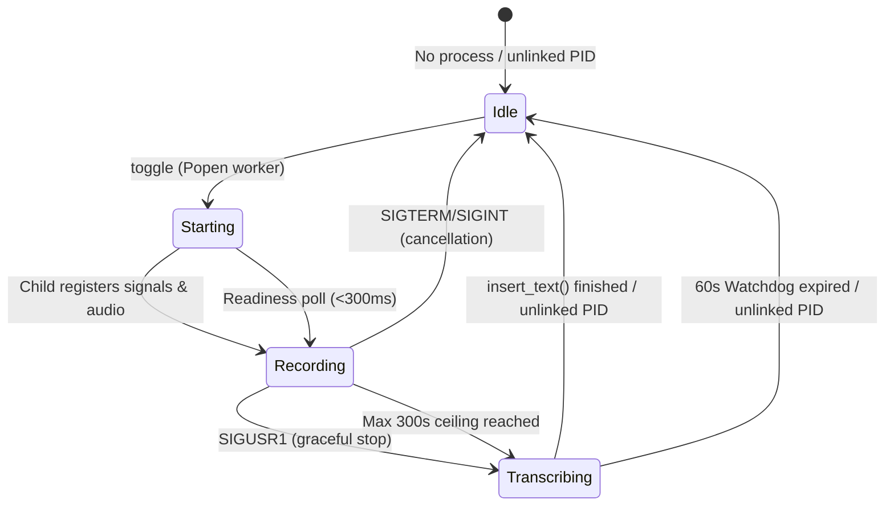

# Phase 4: Hyprland Integration & Daemon Lifecycle - Technical Research

**Phase Target:** Hyprland global keybindings, robust daemon lifecycle management, POSIX signal toggling, dotfiles Lua integration, and focus-safe feedback under Wayland.  
**Requirements Addressed:** `HYPR-01`, `HYPR-02`  
**Research Date:** 2026-09-19  

---

<user_constraints>
## User Constraints from Context

The following constraints, decisions, discretion items, and deferred ideas are copied verbatim from [04-CONTEXT.md](file:///home/pera/github_repo/Voice/.planning/phases/04-hyprland-integration-daemon-lifecycle/04-CONTEXT.md):

### Locked Decisions

#### Hyprland Keybinding Chords & Upstream Conflict Resolution
- **D-01:** Assign **`SUPER + SHIFT + M`** for STT push-to-talk toggle (`voice --toggle`). This chord is already unbound upstream in `custom/keybinds.lua` (reclaimed from volume mute) and pairs naturally with the audio/mic modifier family.
- **D-02:** Assign **`SUPER + T`** for TTS speak-selection (`voice --speak-selection`), explicitly unbinding the upstream terminal bind in `custom/keybinds.lua` (`hl.unbind("SUPER + T")`).
- **D-03:** Terminal access remains fully functional via the existing chords `SUPER + Return` and `CTRL + ALT + T`; no secondary rebind for the terminal is required.
- **D-04:** Enforce unlocked-only execution (`locked = false` / standard `bind`). Prevent accidental microphone activation or transcription keystroke injection when the desktop session screen is locked (`hyprlock`).

#### Configuration Target & Installation Tooling
- **D-05:** Provide desktop auto-detection in `voice.py --install-hotkey` (and `--install-hyprland`): Detect active Hyprland sessions (`HYPRLAND_INSTANCE_SIGNATURE` or `hyprctl`), locate `~/.config/hypr/custom/keybinds.lua`, and safely install the keybinding block. Provide `--print-hyprland` to preview the block without writing.
- **D-06:** Format the configuration inside an idempotent delimited block:
  ```lua
  -- voicemode start
  hl.unbind("SUPER + T")
  hl.bind("SUPER + SHIFT + M", hl.dsp.exec_cmd(HOME .. "/.local/bin/voice --toggle"), { description = "Voice STT: Push-to-talk toggle" })
  hl.bind("SUPER + T", hl.dsp.exec_cmd(HOME .. "/.local/bin/voice --speak-selection"), { description = "Voice TTS: Speak selection" })
  -- voicemode end
  ```
- **D-07:** Preserve dotfiles symlinks: `~/.config/hypr/custom/keybinds.lua` is symlinked to `~/.dotfiles/stow/hypr/.config/hypr/custom/keybinds.lua`. The installer must resolve the real path (`keybinds_path.resolve()`) and update in-place, never replacing the symlink with a regular file.
- **D-08:** Tailor installer strictly to the system's `dots-hyprland` Lua configuration structure (`custom/keybinds.lua`).
- **D-09:** Automatically reload Hyprland after keybinding installation by invoking `hyprctl reload` so shortcuts become active immediately without restarting the session.

#### Daemon Invocation, Binary Paths & Signal Handling
- **D-10:** Use expanded full path `$HOME/.local/bin/voice` (or `HOME .. "/.local/bin/voice"`) in `hl.dsp.exec_cmd` to guarantee executable discovery regardless of Hyprland's session environment PATH.
- **D-11:** **Eliminate Double-Tap Startup Race:** To prevent sending `SIGUSR1` to a newly spawned child before Python registers its signal handler (which would crash the child via default signal termination), track lifecycle states in `recorder.pid` (`starting` -> `recording` -> `transcribing` -> `idle`). If toggled while in `starting`, wait up to 300ms for child readiness before signaling.
- **D-12:** **Transcribing / Busy State Protection:** The recorder process retains its PID lock throughout transcription and text injection until `insert_text` finishes. If the hotkey is pressed while `transcribing`, immediately emit a double-low busy cue (`play_cue(args, "error")`) without interrupting the active typing sequence.
- **D-13:** **Clean Signal Differentiation:**
  - `SIGUSR1`: Sole trigger for graceful stop, transcription, and text typing.
  - `SIGTERM` / `SIGINT`: Immediate clean cancellation (unlinks audio buffer and PID without injecting partial text into the focused window).
- **D-14:** **Symmetric Mutex:**
  - Starting STT recording immediately calls `stop_tts(args, quiet=True)` to silence speaker audio and prevent bleed into the microphone.
  - Starting TTS (`speak_selection`) stops any active STT recording to avoid concurrent audio operations.
- **D-15:** **Stale PID Process Verification:** Hardened `process_alive(pid)` checks both `os.kill(pid, 0)` and inspects `/proc/<pid>/cmdline` to ensure the PID belongs to voicemode/python before signaling, preventing misdirected signals if Linux recycled a PID.
- **D-16:** **Safety Watchdogs:**
  - Max recording duration ceiling of 300s (5 minutes) default, overrideable via `VOICE_MAX_RECORDING_SECONDS`.
  - Watchdog timeout of 60s during transcription/typing to prevent an unkillable daemon state in case of unexpected backend deadlock.

#### Desktop UX & Feedback Behavior
- **D-17:** **Focus-Safe STT Feedback:** Rely on audio sine chimes (880 Hz start chime, dual-tone stop chime, error chime) for the normal STT push-to-talk loop. Suppress routine "Recording...", "Transcribing...", and "Transcript inserted" desktop notifications to prevent Wayland notification daemons (SwayNC/Mako/Quickshell) from stealing keyboard focus during `wtype` keystroke simulation.
- **D-18:** Desktop notification toasts for STT are reserved strictly for exceptional states: errors, no-speech detected, or safety recording duration ceilings.
- **D-19:** **Periodic Audio Cue:** Play a quiet audio tick (8% volume, 55ms) every 5 seconds while recording is active to provide ongoing auditory confirmation that the microphone is hot (`VOICE_RECORDING_BEEP_INTERVAL=5`).
- **D-20:** **TTS Notification Feedback:** Maintain informational toasts for TTS (`Speaking selection: "..."` preview and `Speech stopped` confirmation) configured with low urgency and quick auto-dismiss (`-u low -t 2000`).

### Claude's Discretion
- Internal timeout calibration for readiness polling (300ms limit).
- Exact regex pattern matching for finding existing `-- voicemode start` blocks in `custom/keybinds.lua`.
- Signal mask setup order during daemon initialization.

### Deferred Ideas
- None — discussion stayed strictly within Phase 4 scope.
</user_constraints>

---

<phase_requirements>
## Phase Requirements Coverage

| Requirement ID | Description | Source Decision Mapping | Technical Validation & Implementation Support |
|---|---|---|---|
| `HYPR-01` | Configure and document Hyprland shortcuts (`$mainMod+B` / `SUPER + SHIFT + M` for STT toggle and `SUPER + T` for TTS speak-selection) in `hyprland.conf` / `custom/keybinds.lua`. | D-01, D-02, D-03, D-04, D-05, D-06, D-07, D-08, D-09, D-10 | Add `--install-hyprland`, `--print-hyprland`, and update `--install-hotkey` in `voice.py` to target `~/.config/hypr/custom/keybinds.lua`. Unbind upstream `SUPER + T`, bind `SUPER + SHIFT + M` and `SUPER + T` in an idempotent block, preserve dotfiles symlink (`keybinds_path.resolve()`), and trigger `hyprctl reload`. |
| `HYPR-02` | Verify background daemon process management, PID file tracking, and signal handling (`SIGUSR1`) invoked from Hyprland keybindings. | D-11, D-12, D-13, D-14, D-15, D-16, D-17, D-18, D-19, D-20 | Extend PID file tracking to record lifecycle states (`starting` -> `recording` -> `transcribing` -> `idle`). Implement 300ms polling for child readiness to eliminate double-tap races. Implement busy state protection (`play_cue(args, "error")`). Separate `SIGUSR1` (graceful stop & transcribe) from `SIGTERM`/`SIGINT` (immediate abort & cleanup). Enforce symmetric STT/TTS mutex. Harden `process_alive` via `/proc/<pid>/cmdline`. Add 60s transcription watchdog and suppress routine desktop toasts to guarantee focus safety during `wtype` keystroke typing. |
</phase_requirements>

---

## Executive Summary & Problem Domain

Phase 4 bridges `voicemode` with the user's native desktop environment (Arch Linux running Hyprland 0.56.2 and `dots-hyprland`). The phase focuses on two interrelated subsystems:
1. **Desktop Keybinding & Configuration Integration (`HYPR-01`):** Seamless installation of global Hyprland keybindings using the user's stow-based dotfiles architecture (`~/.config/hypr/custom/keybinds.lua`), unbinding upstream conflicts (`SUPER + T` currently bound to terminal), binding STT push-to-talk (`SUPER + SHIFT + M`) and TTS speak-selection (`SUPER + T`), enforcing unlocked-only execution, and reloading Hyprland dynamically without session restarts.
2. **Hardened Background Daemon Lifecycle (`HYPR-02`):** Turning simple PID-file signaling into an industrial-grade, race-free, focus-safe background daemon. Key challenges resolved include eliminating double-tap crashes when `SIGUSR1` arrives before signal handlers register, protecting transcription and keystroke injection from re-entrant hotkey presses, strictly separating stop-and-type (`SIGUSR1`) from abort-and-unlink (`SIGTERM`/`SIGINT`), preventing audio bleed via symmetric mutex, verifying process identity against PID recycling, and eliminating desktop toast focus stealing during Wayland typing.

---

## Environment Availability & Tool Audit

All required tools, session environment variables, and filesystem paths have been verified on the target system:

| Tool / Resource | Availability Status | Version / Path / Details | Verification Source |
|---|---|---|---|
| `hyprctl` | **Available** | `/usr/bin/hyprctl` (Hyprland 0.56.2) | `[VERIFIED: hyprctl version]` |
| `HYPRLAND_INSTANCE_SIGNATURE` | **Active** | `efb50993780079460b0cbed1363e2166a2de1d9f_...` | `[VERIFIED: env inspect]` |
| `hyprctl reload` | **Functional** | Exits `0` with `ok` | `[VERIFIED: hyprctl reload]` |
| `custom/keybinds.lua` | **Symlink** | `/home/pera/.config/hypr/custom/keybinds.lua` -> `../../../github_repo/.dotfiles/stow/hypr/.config/hypr/custom/keybinds.lua` | `[VERIFIED: ls -la]` |
| `voice` executable | **Symlink** | `/home/pera/.local/bin/voice` -> `/home/pera/.local/bin/voicemode` | `[VERIFIED: ls -la]` |
| `voicemode` wrapper | **Functional** | Sets `PIPEWIRE_PROPS` and calls `.venv/bin/python voice.py` | `[VERIFIED: file inspection]` |
| `notify-send` | **Available** | `/usr/bin/notify-send` supports `-u <urgency>` and `-t <ms>` | `[VERIFIED: notify-send --help]` |
| Python 3.12 Virtualenv | **Functional** | `/home/pera/github_repo/Voice/.venv` | `[VERIFIED: .venv/bin/python --version]` |
| Existing Test Suite | **All Passing** | 51 tests pass in ~0.28s (`discover tests`) | `[VERIFIED: test run]` |

---

## Architectural Design & Detailed Technical Analysis

```
                                    HYPRLAND SESSION
                                           │
             ┌─────────────────────────────┴─────────────────────────────┐
             │ Key Chord: SUPER + SHIFT + M                             │ Key Chord: SUPER + T
             ▼                                                           ▼
   `voice --toggle`                                            `voice --speak-selection`
             │                                                           │
             ├─────────────────────────────────────────┐                 │
             ▼                                         │                 ▼
   Check `recorder.pid`                                │        Stop STT if active (`SIGTERM`)
             │                                         │        Stop active TTS if playing
             ├─── [State: idle / no PID] ──────────────┤        Grab text (wl-paste --primary)
             │    1. stop_tts(quiet=True)              │        Notify TTS toast (-u low -t 2000)
             │    2. proc = Popen([voice ...])         │        Spawn background TTS worker
             │    3. write_pid_state(pid, "starting")  │                 │
             │                                         │                 ▼
             ├─── [State: starting] ───────────────────┤        ffplay audio stream
             │    Wait up to 300ms for "recording"     │
             │    Then send os.kill(pid, SIGUSR1)      │
             │                                         │
             ├─── [State: recording] ──────────────────┤
             │    os.kill(pid, SIGUSR1)                │
             │                                         │
             └─── [State: transcribing] ───────────────┘
                  Emit busy error chime (double-low)
                  Do NOT send signal! Preserve typing!

──────────────────────────────────────────────────────────────────────────────────────────

                              DAEMON WORKER (`--record-background`)
                                           │
                                ┌──────────┴──────────┐
                                │ Register Handlers:  │
                                │ SIGUSR1 -> graceful │
                                │ SIGTERM -> abort    │
                                └──────────┬──────────┘
                                           │
                                 write_pid_state("recording")
                                 play_cue("start") [880 Hz]
                                           │
                     ┌─────────────────────┴─────────────────────┐
                     ▼                                           ▼
             Record Audio Stream                        5s Reminder Cue Tick
             (Watchdog: max 300s)                       (8% volume, 55ms)
                     │                                           │
                     ├───────────────────┬───────────────────────┘
                     │                   │
             Received SIGTERM/SIGINT     Received SIGUSR1 (or 300s limit)
                     │                   │
                     ▼                   ▼
             Abort Immediately!    write_pid_state("transcribing")
             Delete wav buffer     Stop recording, play_cue("stop")
             remove_pid()          Arm 60s transcription watchdog
             sys.exit(0)                 │
                                         ▼
                                   Transcribe (faster-whisper)
                                   Inject keystrokes (wtype)
                                   Disarm watchdog
                                   remove_pid()
```

### 1. Hyprland Keybinding Architecture & Lua Formatting (`HYPR-01`)

The user's desktop utilizes `dots-hyprland` where Hyprland keybindings are loaded via Lua (`/home/pera/.config/hypr/hyprland.lua:31`):
```lua
if is_file_exists(HOME .. "/.config/hypr/custom/keybinds.lua") then
    require("custom.keybinds")
end
```
[VERIFIED: `/home/pera/.config/hypr/hyprland.lua#L31-L33`]

#### Upstream Conflicts & Solution
- **STT Push-to-Talk (`SUPER + SHIFT + M`):**
  Line 20 of `/home/pera/.config/hypr/custom/keybinds.lua` already contains:
  ```lua
  hl.unbind("SUPER + SHIFT + M") -- upstream volume mute (conflicting)
  ```
  [VERIFIED: `/home/pera/.config/hypr/custom/keybinds.lua#L20`]  
  This chord was previously unbound and is completely open for assignment. It groups cleanly with `SUPER + M` (`wpctl set-mute @DEFAULT_AUDIO_SOURCE@ toggle`) and `SUPER + ALT + M` (`wpctl set-mute @DEFAULT_AUDIO_SINK@ toggle`).
- **TTS Speak Selection (`SUPER + T`):**
  Line 346 of `/home/pera/.config/hypr/hyprland/keybinds.lua` binds:
  ```lua
  hl.bind("SUPER + T", hl.dsp.exec_cmd(terminal))
  ```
  [VERIFIED: `/home/pera/.config/hypr/hyprland/keybinds.lua#L346`]  
  To bind `SUPER + T` to voicemode TTS without dual-firing the terminal, `custom/keybinds.lua` MUST issue `hl.unbind("SUPER + T")` before `hl.bind("SUPER + T", ...)`.
- **Terminal Accessibility Preserved:**
  Lines 345 and 347 of `/home/pera/.config/hypr/hyprland/keybinds.lua` bind:
  ```lua
  hl.bind("SUPER + Return", hl.dsp.exec_cmd(terminal), { description = "App: Terminal" })
  hl.bind("CTRL + ALT + T", hl.dsp.exec_cmd(terminal))
  ```
  [VERIFIED: `/home/pera/.config/hypr/hyprland/keybinds.lua#L345-L347`]  
  Terminal access remains fully intact via `SUPER + Return` and `CTRL + ALT + T` (D-03).
- **Lockscreen Security (`locked = false`):**
  Per D-04, bindings must NOT specify `locked = true`. Unlike session lock commands (which use `locked = true` to work during lockscreen), STT and TTS shortcuts must be strictly disabled while locked with `hyprlock` to prevent accidental microphone activation or unauthorized typing injection into a locked workstation.
- **Idempotent Lua Block:**
  Per D-06, the configuration block must match verbatim:
  ```lua
  -- voicemode start
  hl.unbind("SUPER + T")
  hl.bind("SUPER + SHIFT + M", hl.dsp.exec_cmd(HOME .. "/.local/bin/voice --toggle"), { description = "Voice STT: Push-to-talk toggle" })
  hl.bind("SUPER + T", hl.dsp.exec_cmd(HOME .. "/.local/bin/voice --speak-selection"), { description = "Voice TTS: Speak selection" })
  -- voicemode end
  ```
- **Symlink Preservation (`keybinds_path.resolve()`):**
  `/home/pera/.config/hypr/custom/keybinds.lua` is a symlink pointing to `/home/pera/github_repo/.dotfiles/stow/hypr/.config/hypr/custom/keybinds.lua`. Atomic file renaming (`os.replace`) on the symlink path would sever the symlink and turn it into a regular file, breaking dotfiles tracking. Therefore, the installer must resolve `keybinds_path.resolve()` and write directly into the resolved real file path (D-07).
- **Session Auto-Detection & Reload:**
  - Detection: Check `os.getenv("HYPRLAND_INSTANCE_SIGNATURE")` or `shutil.which("hyprctl")` or `XDG_CURRENT_DESKTOP=Hyprland` (D-05).
  - Preview: `--print-hyprland` outputs the Lua block to stdout without modifying disk.
  - Dedicated installer: `--install-hyprland` writes the block and invokes `hyprctl reload` (D-09).
  - Unified installer: `--install-hotkey` / `--install-hotkeys` detects whether Hyprland is active, delegating to `install_hyprland_keybinds()` or GNOME gsettings.

---

### 2. Daemon Lifecycle & State Transitions (`HYPR-02`)

The daemon lifecycle must track states explicitly to prevent concurrency races and process corruption:



#### State Representation in `recorder.pid`
In existing code (`voice.py:595-598`):
```python
def write_pid(path: Path = PID_FILE) -> None:
    STATE_DIR.mkdir(parents=True, exist_ok=True)
    path.write_text(f"{os.getpid()}\n", encoding="utf-8")
```
[VERIFIED: `voice.py#L595-L598`]

To track state per D-11 and D-12:
- Write format: `<pid> <state>\n` (e.g. `12345 starting`, `12345 recording`, `12345 transcribing`).
- `read_pid(path)` remains backward compatible: reads `content.split()[0]` as `int`.
- New `read_pid_state(path) -> tuple[Optional[int], str]`: parses `(pid, state)`. If no state is present, defaults to `"recording"`. If file does not exist, returns `(None, "idle")`.
- `write_pid_state(pid: int, state: str, path: Path = PID_FILE)` writes the atomic state string.

#### Eliminating the Double-Tap Startup Race (D-11)
- **The Problem:** When `voice --toggle` spawns a child process (`Popen`), the child takes ~200-300ms to initialize Python and register signal handlers. If the user double-taps the key within 100ms, the second invocation reads the child PID and sends `SIGUSR1`. Because the child has not yet set a custom handler for `SIGUSR1`, Linux applies the default signal action: **immediate abnormal process termination** (`SIG_DFL` kills the process without error messages or logs).
- **The Solution:**
  1. The parent process writes `<proc.pid> starting` immediately after `subprocess.Popen`.
  2. The child process registers signal handlers first, initializes PortAudio, and writes `<pid> recording`.
  3. When `toggle_background_recording` detects state is `"starting"`, it loops with `time.sleep(0.02)` for up to 300ms waiting for state to become `"recording"` or the child to exit.
  4. Once state is `"recording"`, it delivers `SIGUSR1` safely.

#### Transcribing / Busy State Protection (D-12)
- **The Problem:** If the user presses the hotkey while Whisper is transcribing or `wtype` is injecting characters, sending `SIGUSR1` or launching a second recording daemon causes corrupted transcripts, overlapping keystrokes, or broken audio devices.
- **The Solution:**
  1. While transcribing and typing, state in `recorder.pid` is `"transcribing"`.
  2. If `voice --toggle` is pressed and state is `"transcribing"`, it does NOT send any signal and does NOT spawn a new recorder.
  3. It immediately emits the double-low error cue: `play_cue(args, "error")` (`voice.py:495`: 300 Hz for 80ms, 30ms gap, 200 Hz for 100ms).
  4. The active transcription and typing sequence finishes completely undisturbed.

#### Clean Signal Differentiation (D-13)
- Existing code (`voice.py:1284-1289`):
  ```python
  def request_stop(signum, frame) -> None:
      nonlocal stop_requested
      stop_requested = True

  signal.signal(signal.SIGUSR1, request_stop)
  signal.signal(signal.SIGTERM, request_stop)
  ```
  [VERIFIED: `voice.py#L1284-L1289`]  
  Currently both signals trigger transcription!
- Hardened Behavior:
  - `SIGUSR1`: sets `stop_requested = True` -> normal graceful stop, transcription, and `wtype` text insertion.
  - `SIGTERM` and `SIGINT`: sets `cancel_requested = True` -> immediate abort, unlinks recorded audio buffer (`wav_path.unlink()`), unlinks PID (`remove_pid()`), and exits cleanly with 0 without typing anything.

#### Symmetric STT/TTS Mutex (D-14)
- When starting STT (`toggle_background_recording`):
  Call `stop_tts(args, quiet=True)` before launching recording. Speaker audio is immediately silenced so it cannot bleed into the microphone stream.
- When starting TTS (`speak_selection` / `start_tts_background`):
  Check if STT is active (`read_pid(PID_FILE)`). If alive, send `SIGTERM` (immediate clean cancellation per D-13) and `remove_pid(stt_pid, PID_FILE)`. STT is silenced before TTS starts synthesis or playback.

#### Stale PID Process Verification (D-15)
- Existing code (`voice.py:575-583`):
  ```python
  def process_alive(pid: int) -> bool:
      try:
          os.kill(pid, 0)
          return True
      except ProcessLookupError:
          return False
      except PermissionError:
          return True
  ```
  [VERIFIED: `voice.py#L575-L583`]  
  If the daemon crashed and Linux recycled the PID to another process (e.g. systemd or a browser), `os.kill(pid, 0)` returns True, causing misdirected `SIGUSR1` signals!
- Hardened Check:
  Inspect `/proc/<pid>/cmdline`. The cmdline must contain `"voice"` or `"python"` or `"voicemode"`. If the file does not exist, or raises `PermissionError` (owned by another user), or does not match voicemode tokens, return `False` and clean up the stale PID.

#### Safety Watchdogs (D-16)
- **Recording Ceiling:** `MAX_RECORDING_SECONDS` defaults to 300s (5 min), but must respect `os.getenv("VOICE_MAX_RECORDING_SECONDS")`. If exceeded, automatically stops recording, shows an exceptional desktop notification, and proceeds to transcribe.
- **Transcription Watchdog:** Whisper transcription or `wtype` keystroke simulation could deadlock if an upstream compositor or library hangs. A 60-second watchdog timer (`threading.Timer(60.0, watchdog_callback)`) wraps the transcription and typing block. If 60 seconds expire, the watchdog unlinks `recorder.pid`, logs an error, and terminates the daemon (`os._exit(1)`). When transcription completes normally, `watchdog.cancel()` disarms the timer.

---

### 3. Desktop UX & Focus-Safe Keystroke Injection (D-17 through D-20)

#### Focus Stealing Mitigation (D-17, D-18)
- Under Wayland compositors (Hyprland), notifications spawned via `notify-send` are managed by daemons like SwayNC, Quickshell, or Mako.
- If a notification is displayed when transcription finishes, the notification surface can momentarily capture input focus or disrupt active Wayland window focus tables. When `wtype` subsequently runs, keystrokes are dropped or swallowed by the notification overlay rather than typed into the intended editor or terminal!
- **Rule:** Suppress routine notifications during normal STT dictation:
  - Remove routine `notify(APP_NAME, "Recording...", args)` (`voice.py:1297`).
  - Remove routine `notify(APP_NAME, "Transcribing...", args)` (`voice.py:1322`).
  - Remove routine `notify(APP_NAME, "Transcript inserted.", args)` (`voice.py:1332`).
- **Auditory Cues replace routine toasts:**
  - Start chime: 880 Hz sine chime (70ms).
  - Periodic tick: 1046 Hz quiet tick (55ms, 8% volume) every 5 seconds (D-19).
  - Stop chime: dual-tone descending chime (1175 Hz -> 660 Hz).
  - Error chime: double-low tone (300 Hz -> 200 Hz).
- **Exceptional STT Toasts Retained (D-18):**
  - Errors (`notify(APP_NAME, str(exc), args)`).
  - No speech detected (`notify(APP_NAME, "No speech detected.", args)`).
  - Maximum recording duration reached (`notify(APP_NAME, "Max recording duration (300s) reached...", args)`).

#### Low-Urgency TTS Informational Toasts (D-20)
- Informational TTS toasts (`Speaking selection: "..."` and `Speech stopped.`) remain active because TTS does not simulate keyboard typing.
- Update `notify()` helper to support `urgency: str = "normal"` and `expire_time_ms: Optional[int] = None`.
- For TTS informational toasts, pass `-u low -t 2000` so they auto-dismiss in 2 seconds without user interaction or desktop chime interference.

---

## In-Repo Value Provenance

The following discrete in-repo values and citations are quoted verbatim beside their source paths and line ranges:

| Value / Code Snippet | Source Path & Lines | Usage / Context |
|---|---|---|
| `STATE_DIR = Path(os.getenv("XDG_RUNTIME_DIR", f"/tmp/voice-stt-{os.getuid()}")) / "voice-stt"` | [`voice.py:44`](file:///home/pera/github_repo/Voice/voice.py#L44) | Base runtime state directory for PID and log files |
| `PID_FILE = STATE_DIR / "recorder.pid"` | [`voice.py:45`](file:///home/pera/github_repo/Voice/voice.py#L45) | STT daemon PID lock file |
| `TTS_PID_FILE = STATE_DIR / "tts.pid"` | [`voice.py:46`](file:///home/pera/github_repo/Voice/voice.py#L46) | TTS background playback PID file |
| `LOG_FILE = STATE_DIR / "voice.log"` | [`voice.py:47`](file:///home/pera/github_repo/Voice/voice.py#L47) | STT daemon log file |
| `MAX_RECORDING_SECONDS = 300.0` | [`voice.py:65`](file:///home/pera/github_repo/Voice/voice.py#L65) | Hardcoded default max recording duration ceiling |
| `patterns = { "start": ((880, 0.07),), "recording": ((1046, 0.055),), "stop": ((1175, 0.07), (0, 0.03), (660, 0.11)), "error": ((300, 0.08), (0, 0.03), (200, 0.10)), }` | [`voice.py:491-496`](file:///home/pera/github_repo/Voice/voice.py#L491-L496) | Audio cue tone frequencies and durations |
| `read_pid(path: Path = PID_FILE) -> Optional[int]:` | [`voice.py:567-572`](file:///home/pera/github_repo/Voice/voice.py#L567-L572) | Current PID reading implementation |
| `process_alive(pid: int) -> bool:` | [`voice.py:575-583`](file:///home/pera/github_repo/Voice/voice.py#L575-L583) | Current process aliveness check using `os.kill(pid, 0)` |
| `stop_tts(args: argparse.Namespace, *, quiet: bool = False) -> bool:` | [`voice.py:932-956`](file:///home/pera/github_repo/Voice/voice.py#L932-L956) | TTS stop and cleanup function |
| `toggle_background_recording(args: argparse.Namespace) -> int:` | [`voice.py:1251-1274`](file:///home/pera/github_repo/Voice/voice.py#L1251-L1274) | Current STT toggle entry point |
| `run_background_recording(args: argparse.Namespace) -> int:` | [`voice.py:1277-1358`](file:///home/pera/github_repo/Voice/voice.py#L1277-L1358) | Current STT daemon event loop |
| `hl.unbind("SUPER + SHIFT + M") -- upstream volume mute (conflicting)` | [`custom/keybinds.lua:20`](file:///home/pera/.config/hypr/custom/keybinds.lua#L20) | User keybinds unbinding volume mute (now available for STT) |
| `hl.bind("SUPER + T", hl.dsp.exec_cmd(terminal))` | [`hyprland/keybinds.lua:346`](file:///home/pera/.config/hypr/hyprland/keybinds.lua#L346) | Upstream terminal shortcut conflicting with TTS |
| `hl.bind("SUPER + Return", hl.dsp.exec_cmd(terminal), { description = "App: Terminal" })` | [`hyprland/keybinds.lua:345`](file:///home/pera/.config/hypr/hyprland/keybinds.lua#L345) | Primary terminal shortcut preserved |
| `hl.bind("CTRL + ALT + T", hl.dsp.exec_cmd(terminal))` | [`hyprland/keybinds.lua:347`](file:///home/pera/.config/hypr/hyprland/keybinds.lua#L347) | Secondary terminal shortcut preserved |
| `lrwxrwxrwx ... custom/keybinds.lua -> ../../../github_repo/.dotfiles/stow/hypr/.config/hypr/custom/keybinds.lua` | [`ls -la custom/keybinds.lua`](file:///home/pera/.config/hypr/custom/keybinds.lua) | Symlink target for dotfiles repository |
| `lrwxrwxrwx ... ~/.local/bin/voice -> /home/pera/.local/bin/voicemode` | [`ls -la ~/.local/bin/voice`](file:///home/pera/.local/bin/voice) | Symlink target for executable wrapper |
| `exec env "PULSE_PROP_application.name=voicemode" "${VENV_PYTHON}" "${VOICE_SCRIPT}" "$@"` | [`~/.local/bin/voicemode:18`](file:///home/pera/.local/bin/voicemode#L18) | Launcher environment wrapper |

---

## Validation Architecture & Test Strategy

### Unit Test Suite Expansion

All tests must run via `.venv/bin/python -m unittest discover tests` and execute in <1s without requiring live audio hardware or an interactive Wayland session.

A new test module `tests/test_hyprland_daemon.py` (or additions to `tests/test_wayland_input.py`) should be implemented covering:

1. **`TestHyprlandKeybindInstallation`:**
   - `test_print_hyprland`: Verify `--print-hyprland` outputs the exact Lua block to stdout without touching files.
   - `test_install_hyprland_creates_block`: In a fresh config file, appends the delimited `-- voicemode start` block cleanly.
   - `test_install_hyprland_idempotent_replace`: When a `-- voicemode start` block already exists, replaces it in-place without duplicating lines.
   - `test_install_hyprland_preserves_symlink`: When pointing to a symlink, ensures `target.resolve()` is updated and `target.is_symlink()` remains `True`.
   - `test_install_hyprland_reloads_hyprctl`: Mocks `shutil.which("hyprctl")` and verifies `hyprctl reload` is called with returncode 0.
   - `test_install_hotkey_auto_detection`: When `HYPRLAND_INSTANCE_SIGNATURE` is in environment, `--install-hotkey` calls Hyprland installer instead of GNOME gsettings.
   - `test_unlocked_only_execution`: Asserts that `hl.bind` definitions do not set `locked = true`.

2. **`TestDaemonLifecycleStates`:**
   - `test_write_and_read_pid_state`: Verifies transitions through `starting`, `recording`, `transcribing`, and `idle`.
   - `test_read_pid_backward_compatibility`: Verifies legacy PID file with just an integer still returns `int` from `read_pid()` and defaults to `"recording"` in `read_pid_state()`.
   - `test_double_tap_race_wait`: When state is `starting`, verifies `toggle_background_recording` polls and waits for `recording` state before signaling `SIGUSR1`.
   - `test_busy_state_protection`: When state is `transcribing`, verifies `toggle_background_recording` plays the double-low error cue and does NOT send `SIGUSR1`.
   - `test_signal_differentiation`:
     - `SIGUSR1`: Triggers normal stop, transcription, and typing.
     - `SIGTERM` / `SIGINT`: Cancels immediately, unlinks audio buffer, removes PID, and exits without typing.
   - `test_hardened_process_alive`:
     - Returns `True` when `os.kill(pid, 0)` succeeds AND `/proc/<pid>/cmdline` contains `voice`/`python`.
     - Returns `False` when `os.kill(pid, 0)` succeeds BUT `/proc/<pid>/cmdline` belongs to another process (e.g. `bash` or `systemd`).
     - Returns `False` when `os.kill(pid, 0)` raises `ProcessLookupError`.
   - `test_symmetric_mutex_stt_stops_tts`: Verifies launching STT calls `stop_tts(args, quiet=True)`.
   - `test_symmetric_mutex_tts_stops_stt`: Verifies launching TTS sends `SIGTERM` to active STT PID.
   - `test_max_recording_ceiling_override`: Verifies `VOICE_MAX_RECORDING_SECONDS` environment variable overrides default 300.0.
   - `test_transcription_watchdog`: Verifies 60s timer unlinks PID and exits if transcription hangs.

3. **`TestDesktopNotificationBehavior`:**
   - `test_routine_stt_notifications_suppressed`: Verifies "Recording...", "Transcribing...", and "Transcript inserted." are not sent to `notify()`.
   - `test_exceptional_stt_notifications_allowed`: Verifies error, no-speech, and max-duration toasts are sent to `notify()`.
   - `test_tts_notification_urgency_and_timeout`: Verifies TTS informational toasts pass `-u low -t 2000` to `notify-send`.

---

## Security Domain & Threat Patterns

1. **Lockscreen Keystroke Injection Vulnerability:**
   - *Threat:* If a user locks their workstation (`hyprlock`) while stepping away, someone pressing `SUPER + SHIFT + M` could speak into the microphone and inject transcribed text into the underlying active window.
   - *Mitigation:* Enforce standard `hl.bind` without `locked = true` (D-04). Hyprland suppresses unlocked binds when the lockscreen is active.
2. **PID Recycling & Signal Misdirection:**
   - *Threat:* On long-running Linux systems, PIDs wrap around. If voicemode terminates abruptly and another user or daemon reuses the PID, sending `SIGUSR1` could terminate or disrupt unrelated system services.
   - *Mitigation:* Inspect `/proc/<pid>/cmdline` in `process_alive()` to verify command-line tokens belong to voicemode/python before signaling (D-15).
3. **Symlink Truncation / Breakage:**
   - *Threat:* If `custom/keybinds.lua` is replaced atomically via `tempfile` + `os.replace`, the symlink to `~/.dotfiles` is destroyed and replaced with an unversioned file.
   - *Mitigation:* Resolve the symlink target via `keybinds_path.resolve()` and write directly to the resolved path (D-07).
4. **Daemon Deadlock / Zombie State:**
   - *Threat:* If Whisper or `wtype` hangs indefinitely, the daemon remains in `transcribing` state, permanently locking the user out of speech dictation.
   - *Mitigation:* 60s transcription watchdog timer terminates the process and unlinks the PID file if transcription/typing hangs (D-16).

---

## Planning Pitfalls & Implementation Guidelines

1. **Avoid replacing symlinks with `os.replace`:** Always use `path.resolve().write_text(...)` or open `path.resolve()` when modifying `custom/keybinds.lua`.
2. **Never send `SIGUSR1` to a `starting` child:** Respect the 300ms readiness poll. Delivering `SIGUSR1` to Python before it executes `signal.signal(signal.SIGUSR1, ...)` causes immediate child crash due to `SIG_DFL`.
3. **Do not transcribe on `SIGTERM`:** `SIGTERM` is for cancellation (e.g. user started TTS or system rebooting). Transcription and text injection must ONLY happen on `SIGUSR1` or max recording duration ceiling.
4. **Never show routine toasts right before `wtype`:** A toast appearing 50ms before typing steals compositor focus in Wayland, causing `wtype` keystrokes to vanish into thin air. Rely on the dual-tone descending audio chime for routine confirmation.
5. **Keep `read_pid()` backward-compatible:** Do not break callers expecting `read_pid() -> Optional[int]`. Parse the first token of the PID file as integer, and expose state via `read_pid_state()`.

---

## Suggested Plan Sequence for Phase 4

- **Plan 04-01: Hyprland Keybindings & Dotfiles Integration (`HYPR-01`)**
  - Implement `--print-hyprland`, `--install-hyprland`, and `--install-hotkey` auto-detection in `voice.py`.
  - Implement idempotent Lua block replacement in `~/.config/hypr/custom/keybinds.lua` with symlink preservation (`path.resolve()`).
  - Add `hyprctl reload` execution.
  - Add comprehensive unit tests in `tests/test_hyprland_daemon.py` for keybinding formatting, unbinding, symlink safety, and desktop auto-detection.
- **Plan 04-02: Hardened Daemon Lifecycle, Signals, Mutex & Feedback (`HYPR-02`)**
  - Implement PID lifecycle states (`starting` -> `recording` -> `transcribing` -> `idle`) and helper `read_pid_state()`.
  - Implement double-tap startup race mitigation with 300ms readiness polling.
  - Implement busy state protection (`play_cue(args, "error")`).
  - Differentiate `SIGUSR1` (graceful stop & type) vs `SIGTERM`/`SIGINT` (clean abort & unlink).
  - Implement symmetric STT/TTS mutex (`stop_tts` before STT, cancel STT before TTS).
  - Harden `process_alive` with `/proc/<pid>/cmdline` verification.
  - Add 60s transcription watchdog and `VOICE_MAX_RECORDING_SECONDS` environment override.
  - Suppress routine STT desktop toasts and configure TTS toasts with `-u low -t 2000`.
  - Add comprehensive unit tests validating lifecycle states, race mitigation, signal handling, mutex, process identity, and focus-safe feedback.
