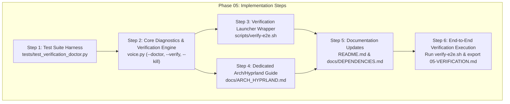

# Phase 5: End-to-End System Verification - Pattern Mapping

**Target Directory:** `/home/pera/github_repo/Voice/.planning/phases/05-end-to-end-system-verification`  
**Generated:** 2026-09-19  
**Phase Requirements:** `VERIF-01`, `VERIF-02`  
**Target Output File:** `05-PATTERNS.md`

---

## 1. Executive Summary & File Classification

Phase 5 delivers comprehensive desktop-global end-to-end validation of `voicemode` under Hyprland on Arch Linux. It verifies push-to-talk STT dictation across terminals (Kitty, Foot) and editors (Neovim, VS Code), TTS reading and stop-playback across browsers (Firefox, Chromium), implements a static system diagnostic engine (`voice --doctor`), builds an automated/interactive 3-tier verification suite (`voice --verify` / `scripts/verify-e2e.sh`), adds daemon recovery (`voice --kill`), and produces complete, polished Arch Linux + Hyprland documentation.

### Target Files to Create / Modify

| File Path | Action | Role | Data Flow Summary |
|---|---|---|---|
| [`voice.py`](file:///home/pera/github_repo/Voice/voice.py) | **Modify** | Controller / CLI Dispatch / Verification Engine / System Doctor | Handles `--doctor`, `--verify`, and `--kill` CLI options; runs static diagnostics across binaries, audio devices (`wpctl`), model weights, Hyprland keybinds, and PID health; executes Tier 2 synthetic loopback and selection round-trip; interrogates active window via `hyprctl activewindow -j`; manages interactive test payload injection via `wtype`; outputs terminal summary tables and exports structured JSON/Markdown verification artifacts. |
| [`tests/test_verification_doctor.py`](file:///home/pera/github_repo/Voice/tests/test_verification_doctor.py) | **Create** | Test Suite | Request-response unit and integration test harness validating `voice --doctor` diagnostics, Tier 1/Tier 2/Tier 3 logic, `hyprctl_active_window` JSON parsing and error handling, payload matrix formatting, daemon recovery cleanup, and CLI flag dispatch. |
| [`scripts/verify-e2e.sh`](file:///home/pera/github_repo/Voice/scripts/verify-e2e.sh) | **Create** | Shell Utility / Launcher Wrapper | Pure-bash wrapper detecting repository virtualenv and forwarding CLI arguments to `voice.py --verify "$@"`. |
| [`README.md`](file:///home/pera/github_repo/Voice/README.md) | **Modify** | Documentation / Root User Guide | Overhauls project README to establish Arch Linux + Hyprland as first-class target; introduces "At a Glance" cheat-sheet table (Hotkeys, Audio Chimes, Recovery Commands); documents step-by-step workflow examples and one-command keybind installation. |
| [`docs/ARCH_HYPRLAND.md`](file:///home/pera/github_repo/Voice/docs/ARCH_HYPRLAND.md) | **Create** | Architectural & Operational Guide | Comprehensive operational guide for Arch Linux + Hyprland detailing dots-hyprland integration, Lua keybindings in `custom/keybinds.lua`, GNU Stow symlink preservation, PipeWire / WirePlumber audio tuning (`wpctl`), Kokoro offline TTS model pipeline, and diagnostic troubleshooting playbooks. |
| [`docs/DEPENDENCIES.md`](file:///home/pera/github_repo/Voice/docs/DEPENDENCIES.md) | **Modify** | Documentation / Reference | Reorganizes dependency documentation to frame dots-hyprland preinstalled tools first (`wl-clipboard`, `libnotify`, `PipeWire`), highlights essential `pacman -S` packages (`wtype`, `ffmpeg`), provides a complete vanilla Arch fallback command, and documents offline model footprints and licenses. |

---

## 2. Pattern Assignments & Codebase Analogs

Each capability required in Phase 5 maps directly to established patterns in the existing codebase:

```
┌─────────────────────────────────────────────────────────┐
│                    EXISTING ANALOG                      │
├─────────────────────────────────────────────────────────┤
│ voice.py:print_tts_check & print_status (1251, 1605)   │ ──► Pattern 1: System Diagnostic Engine (voice --doctor)
│ voice.py:install_hyprland_keybinds (1562-1596)         │ ──► Pattern 2: Compositor IPC & Dynamic Window Interrogation
│ voice.py:play_tone, synthesize_kokoro, transcribe (457) │ ──► Pattern 3: 3-Tier Verification Suite (voice --verify)
│ voice.py:cancel_active_stt & stop_tts (649, 1342)      │ ──► Pattern 4: Daemon Recovery & Stale Lock Cleanup (voice --kill)
│ voice.py:parse_args & main (1717-1940)                 │ ──► Pattern 5: CLI Dispatch & Verification Reporting
│ tests/test_hyprland_daemon.py & test_tts_pipeline.py    │ ──► Pattern 6: Nyquist Unit & Subprocess Mock Testing
│ scripts/voicemode & download-kokoro-assets.sh          │ ──► Pattern 7: Shell Wrapper & Virtualenv Delegation
│ README.md & docs/DEPENDENCIES.md                       │ ──► Pattern 8: Arch-First Documentation & Cheat-Sheet Tables
└─────────────────────────────────────────────────────────┘
```

---

## 3. Detailed Per-File Pattern Assignments & Excerpts

### File 1: `voice.py` (Modify)

- **Role:** Core Controller / CLI Dispatch / Verification Engine / System Doctor
- **Data Flow:** CLI dispatch -> Subprocess IPC (`hyprctl`, `wpctl`, `wtype`, `wl-paste`) -> Audio & AI pipeline execution (`play_tone`, `Kokoro`, `WhisperModel`) -> Terminal summary formatting / JSON export.

#### Pattern 1.1: System Diagnostic Engine (`voice --doctor`)

- **Closest Existing Analogs:**
  - [`voice.py:1251-1295`](file:///home/pera/github_repo/Voice/voice.py#L1251-L1295) (`print_tts_check`): Validates model file paths, minimum byte sizes (300MB / 20MB), package versions via `importlib.metadata`, binary availability with `shutil.which`.
  - [`voice.py:1605-1614`](file:///home/pera/github_repo/Voice/voice.py#L1605-L1614) (`print_status`): Inspects PID file and evaluates process aliveness.
  - [`voice.py:588-637`](file:///home/pera/github_repo/Voice/voice.py#L588-L637) (`read_pid_state`, `process_alive`): Reads multi-token PID file and inspects `/proc/{pid}/cmdline`.

- **Existing Code Excerpt (`voice.py:1274-1295`):**
  ```python
  model_ok = model_path.is_file() and model_path.stat().st_size >= 300_000_000
  voices_ok = voices_path.is_file() and voices_path.stat().st_size >= 20_000_000
  if not model_ok or not voices_ok:
      print("kokoro status: missing or incomplete (run 'python voice.py --download-tts-assets')")
      exit_code = 1
  else:
      try:
          from kokoro_onnx import Kokoro

          kokoro = Kokoro(str(model_path), str(voices_path))
          voice_names = kokoro.get_voices()
          print(f"kokoro status: verified ({len(voice_names)} voices loaded)")
      except Exception as exc:
          print(f"kokoro status: error loading model ({exc})")
          exit_code = 1
  print(f"secondary voice: {SECONDARY_KOKORO_VOICE}")
  print(f"edge-tts: {version('edge-tts')}")
  print(f"kokoro-onnx: {version('kokoro-onnx')}")
  print(f"soundfile: {version('soundfile')}")
  print(f"ffplay: {shutil.which('ffplay') or 'missing'}")
  print(f"xclip: {shutil.which('xclip') or 'missing'}")
  ```

- **Adaptation Pattern to Implement:**
  Implement `run_doctor(args: argparse.Namespace) -> int` and sub-check helpers covering all D-09, D-10, D-11 requirements:
  ```python
  def check_binary(name: str, pkg_hint: str) -> tuple[bool, str, str]:
      path = shutil.which(name)
      if path:
          return True, path, ""
      return False, "missing", f"Install with: {pkg_hint}"

  def check_audio_source_status() -> tuple[bool, str, str]:
      """Check PipeWire / WirePlumber input source volume and mute status via wpctl (D-09)."""
      if not shutil.which("wpctl"):
          return False, "wpctl missing", "Install with: sudo pacman -S wireplumber"
      try:
          proc = subprocess.run(
              ["wpctl", "get-volume", "@DEFAULT_AUDIO_SOURCE@"],
              capture_output=True,
              text=True,
              timeout=2.0,
              check=False,
          )
          if proc.returncode != 0:
              return False, f"wpctl query error ({proc.returncode})", "Ensure PipeWire & WirePlumber are running"
          output = proc.stdout.strip()
          is_muted = "[MUTED]" in output
          tokens = output.split()
          vol_str = tokens[1] if len(tokens) > 1 else "unknown"
          if is_muted:
              return (
                  False,
                  f"Volume: {vol_str} [MUTED]",
                  "Unmute with: wpctl set-mute @DEFAULT_AUDIO_SOURCE@ 0 (or press SUPER + M)",
              )
          return True, f"Volume: {vol_str} (Active)", ""
      except Exception as exc:
          return False, f"Audio probe error ({exc})", "Check WirePlumber service"

  def check_hyprland_keybinds_status(config_path: Path | None = None) -> tuple[bool, str, str]:
      """Check Hyprland Lua keybinds and preserve Stow symlink integrity (D-09, D-15)."""
      path = config_path if config_path is not None else HYPRLAND_CUSTOM_KEYBINDS_PATH
      if not path.exists():
          return False, f"Missing {path}", "Install with: voice --install-hotkey"
      is_symlink = path.is_symlink()
      resolved = path.resolve()
      try:
          content = resolved.read_text(encoding="utf-8", errors="replace")
      except Exception as exc:
          return False, f"Error reading {resolved}: {exc}", "Check file permissions"
      
      has_block = "-- voicemode start" in content and "-- voicemode end" in content
      has_stt = "SUPER + SHIFT + M" in content and "--toggle" in content
      has_tts = "SUPER + T" in content and "--speak-selection" in content
      has_unbind = 'hl.unbind("SUPER + T")' in content
      
      if not (has_block and has_stt and has_tts and has_unbind):
          return False, f"Incomplete keybindings in {resolved}", "Update with: voice --install-hotkey"
      sym_desc = f" (symlink -> {resolved})" if is_symlink else " (regular file)"
      return True, f"Verified{sym_desc}", ""

  def check_daemon_pid_health() -> list[tuple[str, bool, str, str]]:
      """Inspect active and stale daemon PID files (D-11)."""
      results = []
      for label, pid_file in (("Recorder daemon", PID_FILE), ("TTS player", TTS_PID_FILE)):
          if not pid_file.exists():
              results.append((label, True, "Idle (no PID file)", ""))
              continue
          pid, state = read_pid_state(pid_file)
          if pid is None:
              results.append((label, False, f"Corrupt PID file ({pid_file})", "Run: voice --kill"))
              continue
          if process_alive(pid):
              results.append((label, True, f"Running (PID {pid}, state: {state})", ""))
          else:
              results.append((label, False, f"Stale lock (PID {pid} dead, state: {state})", "Recover with: voice --kill"))
      return results
  ```

#### Pattern 1.2: Dynamic Compositor Interrogation (`hyprctl_active_window`)

- **Closest Existing Analog:**
  - [`voice.py:1587-1595`](file:///home/pera/github_repo/Voice/voice.py#L1587-L1595) (`subprocess.run(["hyprctl", "reload"])`): Interacts with Hyprland IPC socket.

- **Adaptation Pattern to Implement:**
  Implement `hyprctl_active_window(countdown_seconds: int = 0) -> dict[str, Any] | None` per D-07:
  ```python
  def hyprctl_active_window(countdown_seconds: int = 0) -> dict[str, Any] | None:
      """Query Hyprland active window via hyprctl activewindow -j with countdown (D-07)."""
      if not shutil.which("hyprctl"):
          return None
      if countdown_seconds > 0:
          for remaining in range(countdown_seconds, 0, -1):
              sys.stdout.write(f"\rSwitch to target window... {remaining}s ")
              sys.stdout.flush()
              time.sleep(1.0)
          sys.stdout.write("\r" + " " * 40 + "\r")
          sys.stdout.flush()

      try:
          proc = subprocess.run(
              ["hyprctl", "activewindow", "-j"],
              capture_output=True,
              text=True,
              timeout=2.0,
              check=False,
          )
          if proc.returncode != 0 or not proc.stdout.strip():
              return None
          data = json.loads(proc.stdout)
          if isinstance(data, dict) and data.get("class"):
              return data
          return None
      except (subprocess.SubprocessError, json.JSONDecodeError, OSError):
          return None
  ```

#### Pattern 1.3: 3-Tier Verification Suite (`voice --verify`)

- **Closest Existing Analogs:**
  - [`voice.py:457-485`](file:///home/pera/github_repo/Voice/voice.py#L457-L485) (`play_tone`): Generates sine wave audio cues in-memory using NumPy.
  - [`voice.py:949-975`](file:///home/pera/github_repo/Voice/voice.py#L949-L975) (`synthesize_kokoro_tts`): Synthesizes audio to WAV file via Kokoro ONNX.
  - [`voice.py:522-540`](file:///home/pera/github_repo/Voice/voice.py#L522-L540) (`load_model`) & [`voice.py:700-725`](file:///home/pera/github_repo/Voice/voice.py#L700-L725) (`transcribe`): Loads Faster-Whisper and transcribes audio WAV files.
  - [`voice.py:890-905`](file:///home/pera/github_repo/Voice/voice.py#L890-L905) (`read_x_selection`): Reads Wayland primary selection via `wl-paste --primary`.
  - [`voice.py:742-777`](file:///home/pera/github_repo/Voice/voice.py#L742-L777) (`type_text`): Injects text via `wtype`.

- **Adaptation Pattern to Implement:**
  Structure `run_verification(args: argparse.Namespace) -> int` with 3 modular tiers per D-05:
  ```python
  TEST_PAYLOADS = [
      ("Conversational prose", "The quick brown fox jumps over the lazy dog."),
      ("Punctuation & capitalization", "Hello, World! How are you doing today?"),
      ("Programming code & symbols", 'def calculate_total(items, tax=0.08): return sum(x["price"] for x in items) * (1.0 + tax)'),
      ("Multi-line text (newlines)", "Line one: start of block\nLine two: middle of block\nLine three: end of block"),
  ]

  def run_tier1_diagnostics(args: argparse.Namespace) -> tuple[bool, list[dict[str, Any]]]:
      """Tier 1: Static Pre-Flight Diagnostics (D-05). Instant, non-destructive."""
      # Runs doctor checks and collects structured results
      ...

  def run_tier2_pipeline_test(args: argparse.Namespace) -> tuple[bool, list[dict[str, Any]]]:
      """Tier 2: Automated Pipeline Self-Test (D-05). Runs synthetic loopback in 3-5 seconds."""
      # 1. Cue Tone Generation: synthesized via play_tone or in-memory numpy buffer
      # 2. Kokoro TTS Synthesis: synthesize synthetic phrase to temp WAV (~1.4s)
      # 3. Faster-Whisper STT Loopback: transcribe temp WAV (~1.9s) and assert transcript matches
      # 4. Wayland Primary Selection Round-Trip: copy token to wl-copy --primary and read back via wl-paste --primary
      ...

  def run_tier3_interactive_test(args: argparse.Namespace) -> tuple[bool, list[dict[str, Any]]]:
      """Tier 3: Interactive Application Matrix (D-05, D-07, D-08). Live compositor testing."""
      # Prompts user to focus target window (Kitty, Foot, Neovim, VS Code, Firefox)
      # Dynamically reads window class with hyprctl_active_window(countdown_seconds=3)
      # Injects test payloads via type_text(payload, args)
      # Prompts user confirmation [Y/n]
      ...
  ```

#### Pattern 1.4: Daemon Recovery Command (`voice --kill`)

- **Closest Existing Analogs:**
  - [`voice.py:649-659`](file:///home/pera/github_repo/Voice/voice.py#L649-L659) (`cancel_active_stt`): Sends `SIGTERM` to recorder PID and removes PID file.
  - [`voice.py:1342-1365`](file:///home/pera/github_repo/Voice/voice.py#L1342-L1365) (`stop_tts`): Sends `SIGUSR1` to TTS background player.

- **Existing Code Excerpt (`voice.py:649-659`):**
  ```python
  def cancel_active_stt() -> None:
      pid, _ = read_pid_state(PID_FILE)
      if pid and process_alive(pid):
          try:
              os.kill(pid, signal.SIGTERM)
          except ProcessLookupError:
              pass
          except Exception:
              pass
          remove_pid(pid)
  ```

- **Adaptation Pattern to Implement:**
  Add `kill_all_daemons(args: argparse.Namespace) -> int` to cleanly terminate any stuck STT or TTS processes and wipe state files (D-11, D-34):
  ```python
  def kill_all_daemons(args: argparse.Namespace) -> int:
      """Terminate active recorder/TTS processes and purge stale PID locks (D-11)."""
      killed = 0
      for label, pid_file, sig in (
          ("STT recorder", PID_FILE, signal.SIGTERM),
          ("TTS player", TTS_PID_FILE, signal.SIGTERM),
      ):
          pid, state = read_pid_state(pid_file)
          if pid and process_alive(pid):
              try:
                  os.kill(pid, sig)
                  killed += 1
                  print(f"Terminated {label} (PID {pid}, state: {state}).")
              except Exception as exc:
                  print(f"Error terminating {label} (PID {pid}): {exc}", file=sys.stderr)
          remove_pid(pid, path=pid_file)
      print(f"Daemon recovery complete. Cleaned {killed} active process(es) and purged PID files.")
      return 0
  ```

#### Pattern 1.5: CLI Argument Parsing and Dispatch

- **Closest Existing Analog:**
  - [`voice.py:1742-1774`](file:///home/pera/github_repo/Voice/voice.py#L1742-L1774) (`parse_args` flag definitions)
  - [`voice.py:1889-1940`](file:///home/pera/github_repo/Voice/voice.py#L1889-L1940) (`main` dispatch block)

- **Adaptation Pattern to Implement:**
  Register `--doctor`, `--verify`, `--kill`, `--tier`, `--json`, `--export-markdown` in `parse_args()` and wire into `main()`:
  ```python
  parser.add_argument("--doctor", action="store_true", help="Run system pre-flight diagnostic probe.")
  parser.add_argument("--verify", action="store_true", help="Run end-to-end system verification suite.")
  parser.add_argument(
      "--tier",
      choices=("1", "2", "3", "all"),
      default="all",
      help="Verification tier to run: 1 (static), 2 (automated self-test), 3 (interactive), or all. Default: all.",
  )
  parser.add_argument("--json", action="store_true", help="Output verification/doctor results as JSON.")
  parser.add_argument("--export-markdown", type=Path, default=None, help="Export verification report to markdown file.")
  parser.add_argument("--kill", action="store_true", help="Terminate active background workers and purge stale PID files.")
  ```

---

### File 2: `tests/test_verification_doctor.py` (Create)

- **Role:** Test Suite
- **Data Flow:** Unit & Integration test execution -> Assertions on return codes, JSON payloads, terminal outputs, and error handling.
- **Closest Existing Analog:**
  - [`tests/test_hyprland_daemon.py:17-157`](file:///home/pera/github_repo/Voice/tests/test_hyprland_daemon.py#L17-L157): Uses `unittest.TestCase`, `patch("subprocess.run")`, `patch("shutil.which")`, `tempfile.TemporaryDirectory()`, `io.StringIO()`.
  - [`tests/test_tts_pipeline.py:16-100`](file:///home/pera/github_repo/Voice/tests/test_tts_pipeline.py#L16-L100): Validates size bounds, model presence, and CLI flags.

- **Existing Code Excerpt (`tests/test_hyprland_daemon.py:45-61`):**
  ```python
  def test_print_hyprland_stdout(self) -> None:
      with patch("sys.stdout", new=io.StringIO()) as fake_stdout:
          ret = voice.print_hyprland_keybinds()
          self.assertEqual(ret, 0)
          self.assertEqual(fake_stdout.getvalue(), voice.generate_hyprland_block())

  def test_install_hyprland_creates_block(self) -> None:
      with tempfile.TemporaryDirectory() as tmp_dir:
          target_file = Path(tmp_dir) / "custom" / "keybinds.lua"
          with patch("shutil.which", return_value=None):
              ret = voice.install_hyprland_keybinds(config_path=target_file)
          self.assertEqual(ret, 0)
          self.assertTrue(target_file.exists())
  ```

- **Adaptation Pattern to Implement:**
  Structure test cases mirroring the 3 tiers and doctor checks:
  ```python
  import io
  import json
  import os
  import subprocess
  import tempfile
  import unittest
  from pathlib import Path
  from unittest.mock import MagicMock, patch

  import voice

  class TestDoctorDiagnostics(unittest.TestCase):
      """Tests for voice --doctor static pre-flight diagnostics (D-09, D-10, D-11)."""

      def test_check_binary_present_vs_missing(self) -> None:
          with patch("shutil.which", side_effect=lambda b: "/usr/bin/" + b if b == "wtype" else None):
              ok, path, hint = voice.check_binary("wtype", "sudo pacman -S wtype")
              self.assertTrue(ok)
              self.assertEqual(path, "/usr/bin/wtype")

              ok_miss, path_miss, hint_miss = voice.check_binary("missing_tool", "sudo pacman -S missing")
              self.assertFalse(ok_miss)
              self.assertIn("sudo pacman -S missing", hint_miss)

      def test_check_audio_source_active_vs_muted(self) -> None:
          with patch("shutil.which", return_value="/usr/bin/wpctl"):
              # Muted case
              mock_proc_muted = MagicMock(returncode=0, stdout="Volume: 1.00 [MUTED]\n")
              with patch("subprocess.run", return_value=mock_proc_muted):
                  ok, status, hint = voice.check_audio_source_status()
                  self.assertFalse(ok)
                  self.assertIn("[MUTED]", status)
                  self.assertIn("wpctl set-mute", hint)

              # Active unmuted case
              mock_proc_active = MagicMock(returncode=0, stdout="Volume: 0.85\n")
              with patch("subprocess.run", return_value=mock_proc_active):
                  ok, status, hint = voice.check_audio_source_status()
                  self.assertTrue(ok)
                  self.assertIn("0.85", status)
                  self.assertIn("Active", status)

      def test_check_hyprland_keybinds_symlink_preservation(self) -> None:
          with tempfile.TemporaryDirectory() as tmp_dir:
              dotfiles_dir = Path(tmp_dir) / "dotfiles"
              dotfiles_dir.mkdir()
              real_lua = dotfiles_dir / "keybinds.lua"
              real_lua.write_text(voice.generate_hyprland_block(), encoding="utf-8")

              config_dir = Path(tmp_dir) / "config" / "hypr" / "custom"
              config_dir.mkdir(parents=True)
              symlink_lua = config_dir / "keybinds.lua"
              symlink_lua.symlink_to(real_lua)

              ok, status, hint = voice.check_hyprland_keybinds_status(config_path=symlink_lua)
              self.assertTrue(ok)
              self.assertIn("symlink", status)

      def test_check_daemon_pid_health_stale_detection(self) -> None:
          with tempfile.TemporaryDirectory() as tmp_dir:
              fake_pid_file = Path(tmp_dir) / "recorder.pid"
              fake_pid_file.write_text("8888 recording\n", encoding="utf-8")
              with patch("voice.PID_FILE", fake_pid_file), patch("voice.process_alive", return_value=False):
                  results = voice.check_daemon_pid_health()
                  stt_result = [r for r in results if "Recorder" in r[0]][0]
                  self.assertFalse(stt_result[1])
                  self.assertIn("Stale lock", stt_result[2])
                  self.assertIn("voice --kill", stt_result[3])

  class TestCompositorInterrogation(unittest.TestCase):
      """Tests for hyprctl activewindow inspection (D-07)."""

      def test_hyprctl_active_window_success(self) -> None:
          sample_json = json.dumps({"class": "kitty", "title": "nvim voice.py", "pid": 1234})
          with patch("shutil.which", return_value="/usr/bin/hyprctl"), \
               patch("subprocess.run", return_value=MagicMock(returncode=0, stdout=sample_json)):
              win = voice.hyprctl_active_window()
              self.assertIsNotNone(win)
              self.assertEqual(win["class"], "kitty")

      def test_hyprctl_active_window_empty_workspace(self) -> None:
          # Returns {} when workspace has no active windows
          with patch("shutil.which", return_value="/usr/bin/hyprctl"), \
               patch("subprocess.run", return_value=MagicMock(returncode=0, stdout="{}")):
              win = voice.hyprctl_active_window()
              self.assertIsNone(win)

  class TestVerificationTiers(unittest.TestCase):
      """Tests for Tier 1, Tier 2, and Tier 3 execution logic."""

      def test_tier2_primary_selection_loopback(self) -> None:
          with patch("subprocess.run") as mock_run:
              mock_run.side_effect = [
                  MagicMock(returncode=0),  # wl-copy
                  MagicMock(returncode=0, stdout="test-token-123\n"),  # wl-paste
              ]
              ok = voice.verify_wayland_primary_selection_loopback("test-token-123")
              self.assertTrue(ok)
  ```

---

### File 3: `scripts/verify-e2e.sh` (Create)

- **Role:** Shell Utility / Wrapper
- **Data Flow:** CLI command execution -> Virtualenv resolution -> Delegated Python execution.
- **Closest Existing Analogs:**
  - [`scripts/voicemode:1-19`](file:///home/pera/github_repo/Voice/scripts/voicemode#L1-L19): Standard launcher wrapper with virtualenv pathing and environment variables.
  - [`scripts/download-kokoro-assets.sh:1-18`](file:///home/pera/github_repo/Voice/scripts/download-kokoro-assets.sh#L1-L18): Strict bash error trapping (`set -euo pipefail`) and runtime detection.

- **Existing Code Excerpt (`scripts/voicemode:1-18`):**
  ```bash
  #!/usr/bin/env bash
  # voicemode launcher - Arch Linux / Hyprland
  set -euo pipefail

  REPO_DIR="$(cd "$(dirname "${BASH_SOURCE[0]}")/.." && pwd)"
  VENV_PYTHON="${REPO_DIR}/.venv/bin/python"
  VOICE_SCRIPT="${REPO_DIR}/voice.py"

  # Enforce PipeWire and PulseAudio client node labeling (D-11)
  export PIPEWIRE_PROPS='{ application.name = voicemode }'

  if [ ! -x "${VENV_PYTHON}" ]; then
      echo "Error: voicemode virtualenv not found at ${VENV_PYTHON}" >&2
      echo "Run Phase 1 setup to initialize the Python 3.12 virtualenv." >&2
      exit 1
  fi

  exec env "PULSE_PROP_application.name=voicemode" "${VENV_PYTHON}" "${VOICE_SCRIPT}" "$@"
  ```

- **Adaptation Pattern to Implement:**
  Create executable `scripts/verify-e2e.sh` per D-06:
  ```bash
  #!/usr/bin/env bash
  # voicemode end-to-end verification launcher - Arch Linux / Hyprland
  set -euo pipefail

  REPO_DIR="$(cd "$(dirname "${BASH_SOURCE[0]}")/.." && pwd)"
  VENV_PYTHON="${REPO_DIR}/.venv/bin/python"
  VOICE_SCRIPT="${REPO_DIR}/voice.py"

  if [ ! -x "${VENV_PYTHON}" ]; then
      echo "Error: voicemode virtualenv not found at ${VENV_PYTHON}" >&2
      echo "Please initialize the Python 3.12 virtualenv first." >&2
      exit 1
  fi

  exec "${VENV_PYTHON}" "${VOICE_SCRIPT}" --verify "$@"
  ```

---

### File 4: `README.md` (Modify)

- **Role:** Documentation / Root User Guide
- **Data Flow:** Static markdown documentation.
- **Closest Existing Analog:**
  - [`README.md:1-45`](file:///home/pera/github_repo/Voice/README.md#L1-L45): Existing root guide, currently containing legacy GNOME/apt references.

- **Existing Code Excerpt (`README.md:14-21`):**
  ```markdown
  Tested target:

  OS: Arch Linux
  Compositor: Hyprland (Wayland)
  Python: 3.12
  STT: faster-whisper (CPU int8)
  TTS default: Kokoro via kokoro-onnx
  Text insertion: wtype (primary, rootless) with ydotool fallback
  Selection reading / Clipboard: wl-clipboard (wl-copy, wl-paste)
  ```

- **Adaptation Pattern to Implement:**
  Update `README.md` to:
  1. Feature Arch Linux + Hyprland as the primary first-class platform (D-12, D-14).
  2. Add an "At a Glance" cheat-sheet table per D-12:
     | Shortcut | Action | Scope | Chime Cue |
     |---|---|---|---|
     | `SUPER + SHIFT + M` | Push-to-Talk STT Toggle | Global | Start: 880 Hz (A5) high chime<br/>Reminder: 1046 Hz (C6) tick every 5s<br/>Stop: 1175 Hz -> 660 Hz falling chime |
     | `SUPER + T` | Read Selected Text (TTS) | Global | Plays highlighted text via Kokoro ONNX |
     | `SUPER + T` *(while playing)* | Stop Active Speech | Global | Immediate playback halt |
     | `voice --doctor` | Pre-flight diagnostics | Terminal | Validates binaries, mic mute, models, keybinds |
     | `voice --verify` | 3-tier E2E verification | Terminal | Automated & interactive verification suite |
     | `voice --kill` | Daemon recovery | Terminal | Kills active daemons and clears stale PID locks |
  3. Replace `sudo apt install` with Arch Linux `dots-hyprland` defaults + `sudo pacman -S wtype ffmpeg` prerequisites (D-14).
  4. Document one-command installer `voice --install-hotkey` explaining GNU Stow preservation (D-15).

---

### File 5: `docs/ARCH_HYPRLAND.md` (Create)

- **Role:** Architectural & Operational Guide
- **Data Flow:** Static markdown documentation.
- **Closest Existing Analogs:**
  - [`docs/DEPENDENCIES.md`](file:///home/pera/github_repo/Voice/docs/DEPENDENCIES.md)
  - [`.planning/phases/04-hyprland-integration-daemon-lifecycle/04-RESEARCH.md`](file:///home/pera/github_repo/Voice/.planning/phases/04-hyprland-integration-daemon-lifecycle/04-RESEARCH.md)

- **Adaptation Pattern to Implement:**
  Author `docs/ARCH_HYPRLAND.md` per D-13 with sections:
  1. **Architecture Overview**: Rootless Wayland typing (`wtype` + `zwp_virtual_keyboard_v1`), primary selection reading (`wl-paste --primary`), offline AI inference (Faster-Whisper + Kokoro ONNX).
  2. **dots-hyprland Integration**: Native Lua configuration in `custom/keybinds.lua`, `hl.bind`, `hl.unbind`, unlocked execution (`locked = false`).
  3. **GNU Stow Symlink Preservation**: Safe realpath resolution preventing dotfiles repository decoupling.
  4. **Audio Routing & Tuning**: WirePlumber node inspection via `wpctl status`, input mute diagnosis via `wpctl get-volume @DEFAULT_AUDIO_SOURCE@`, client node labeling (`PIPEWIRE_PROPS='{ application.name = voicemode }'`).
  5. **Model Asset Pipeline**: Kokoro weights in `models/kokoro/`, Faster-Whisper cache in `~/.cache/huggingface/hub/`.
  6. **Troubleshooting & Recovery Playbook**: Stale PID recovery (`voice --kill`), mic unmuting (`wpctl set-mute @DEFAULT_AUDIO_SOURCE@ 0`), pre-type focus settling (`--pre-type-delay 50`).

---

### File 6: `docs/DEPENDENCIES.md` (Modify)

- **Role:** Dependency and System Package Reference
- **Data Flow:** Static markdown documentation.
- **Closest Existing Analog:**
  - [`docs/DEPENDENCIES.md:20-27`](file:///home/pera/github_repo/Voice/docs/DEPENDENCIES.md#L20-L27)

- **Existing Code Excerpt (`docs/DEPENDENCIES.md:20-27`):**
  ```markdown
  ## Wayland Input & Clipboard Stack

  | Component | Package (Arch) | Role | Permissions |
  |---|---|---|---|
  | `wtype` | `wtype` | Rootless keystroke injection & simulated shortcuts | Unprivileged (interfaces with `zwp_virtual_keyboard_v1`) |
  | `wl-clipboard` | `wl-clipboard` | Clipboard management (`wl-copy`, `wl-paste`) | Unprivileged |
  | `ydotool` | `ydotool` | Secondary fallback typing backend | Optional (requires root/uinput daemon `ydotoold`) |
  ```

- **Adaptation Pattern to Implement:**
  Update `docs/DEPENDENCIES.md` per D-14:
  1. Frame `dots-hyprland` defaults first: clarify that `wl-clipboard`, `libnotify`, `PipeWire`, and `wireplumber` are already preinstalled and configured in standard dots-hyprland environments.
  2. Highlight the two essential `pacman -S` additions needed:
     ```bash
     sudo pacman -S wtype ffmpeg
     ```
  3. Provide full fallback `pacman` command for vanilla Arch Linux:
     ```bash
     sudo pacman -S wtype ffmpeg wl-clipboard libnotify pipewire wireplumber
     ```
  4. Document Python virtual environment dependencies managed via `uv`.
  5. Detail offline model disk footprint: Kokoro ONNX model (325MB), voices binary (28MB), Faster-Whisper small.en (~480MB).

---

## 4. Verification & Testing Matrix

| Requirement | Test Implementation | Target Test File |
|---|---|---|
| **VERIF-01** (STT Verification across Terminals & Editors) | Unit tests for `check_binary("wtype")`, PipeWire audio source mute inspection, Faster-Whisper cache checks; Tier 2 synthetic Kokoro-to-Whisper loopback self-test; Tier 3 interactive application matrix with `hyprctl activewindow -j` dynamic class detection testing Kitty, Foot, Neovim, and VS Code. | [`tests/test_verification_doctor.py`](file:///home/pera/github_repo/Voice/tests/test_verification_doctor.py) |
| **VERIF-02** (TTS Verification across Browsers & Readers) | Unit tests for `check_binary("ffplay")`, Kokoro ONNX weights check; Tier 2 Wayland primary selection loopback (`wl-copy --primary` -> `wl-paste --primary`) and Kokoro synthesis; Tier 3 interactive highlight testing across Firefox and Chromium with stop-playback interrupt handling. | [`tests/test_verification_doctor.py`](file:///home/pera/github_repo/Voice/tests/test_verification_doctor.py) |
| **DOCTOR-01** (System Diagnostic Engine) | Tests verifying output, exit codes, and Arch remediation hints for missing binaries, muted microphone, missing models, corrupted/missing Lua keybinds, and stale/orphaned daemon PID files. | [`tests/test_verification_doctor.py`](file:///home/pera/github_repo/Voice/tests/test_verification_doctor.py) |
| **RECOVER-01** (Daemon Process Recovery) | Tests verifying `voice --kill` cleanly sends `SIGTERM` to active workers, purges stale PID files, and returns 0. | [`tests/test_verification_doctor.py`](file:///home/pera/github_repo/Voice/tests/test_verification_doctor.py) |

---

## 5. Implementation Sequence & Dependency Graph



---
*Phase 05 pattern mapping completed on 2026-09-19.*
