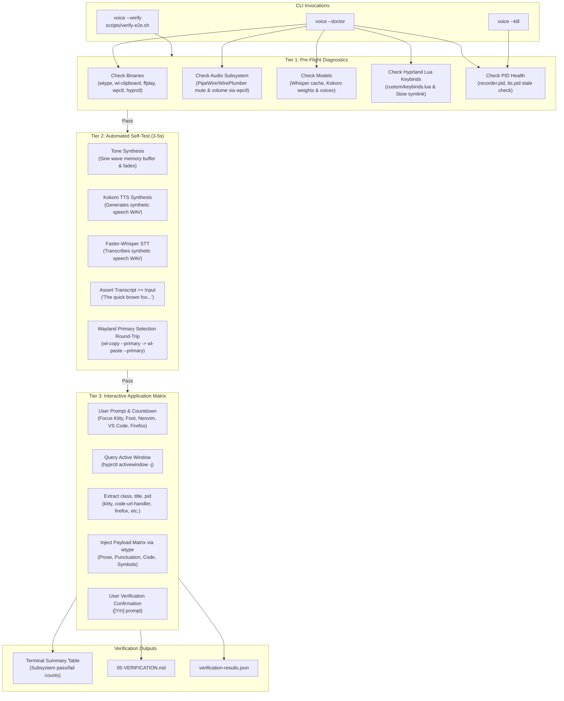

# Phase 05: End-to-End System Verification - Research

**Researched:** 2026-09-19  
**Status:** Complete  
**Confidence:** HIGH  

---

<user_constraints>
## User Constraints (from CONTEXT.md)

### Locked Decisions

#### Target Applications & Window Matrix
- **D-01:** Focus on **Kitty** and **Foot** as primary terminal targets (Kitty is default on dots-hyprland; Foot is native pure-Wayland) with Alacritty secondary.
- **D-02:** Verify both **Terminal Editors** (Neovim / Helix running inside Kitty/Foot) and **GUI Wayland/Electron IDEs** (VS Code / Cursor / Zed).
- **D-03:** Verify **Firefox** (native Wayland primary selection) and **Chromium-based browsers** (Brave/Chrome), plus document readers (Zathura / Evince) for `SUPER + T` selection capture (`wl-paste --primary`).
- **D-04:** Test a standardized payload matrix: conversational prose, punctuation & capitalization, programming code snippets with special symbols (`{}[]()$"'\`), and multi-line text with newlines.

#### Verification Strategy & Tooling Architecture
- **D-05:** Implement a 3-tier verification architecture:
  - **Tier 1 (Static Pre-Flight Diagnostics):** Instant, non-destructive check of binaries, permissions, audio devices, and models via `voice --doctor`.
  - **Tier 2 (Automated Pipeline Self-Test):** Zero human effort test running in 3-5 seconds (audio cue tone synthesis, synthetic audio transcription, Kokoro TTS synthesis, Wayland primary selection round-trip).
  - **Tier 3 (Interactive Application Matrix):** Live desktop testing across user-focused windows with dynamic compositor inspection.
- **D-06:** Expose `voice --verify` as a built-in CLI command backed by `scripts/verify-e2e.sh`, accessible easily from anywhere in the user's PATH via `~/.local/bin/voice`.
- **D-07:** **Dynamic Window Inspection via `hyprctl activewindow -j`:** Instead of hardcoding application locks, the interactive verifier prompts the user to focus their target window, dynamically detects the active window class (e.g. `kitty`, `code-url-handler`, `firefox`), and injects test text using `wtype`.
- **D-08:** Print a rich terminal summary table (pass/fail per subsystem) and export a structured verification artifact (`05-VERIFICATION.md` / `verification-results.json`) for the phase record.

#### Troubleshooting & System Diagnostics (`voice --doctor`)
- **D-09:** Implement a first-class `voice --doctor` diagnostic command that verifies binaries (`wtype`, `wl-copy`, `wl-paste`, `ffplay`), audio devices (PipeWire / WirePlumber input source and mute state via `wpctl`, PortAudio listing), model weights (Whisper cache, Kokoro weights in `models/kokoro/`), Hyprland keybind status in `custom/keybinds.lua`, and active daemon PID health.
- **D-10:** Provide exact Arch Linux package commands (`sudo pacman -S wtype ffmpeg`, `scripts/download-kokoro-assets.sh`, `voice --install-hotkey`) directly in doctor remediation hints.
- **D-11:** Doctor checks active PID file health (`recorder.pid`, `tts.pid`), identifies orphaned or stale daemon processes, and suggests recovery commands (`voice --log`, `voice --kill`).

#### Documentation & Arch/Hyprland Guide
- **D-12:** Update `README.md` to establish Arch Linux + Hyprland as the first-class setup, featuring an "At a Glance" cheat-sheet table (Shortcuts, Chime Meanings, Status/Recovery Commands) and step-by-step workflow examples.
- **D-13:** Create a comprehensive `docs/ARCH_HYPRLAND.md` guide detailing dots-hyprland integration, Lua keybindings in `custom/keybinds.lua` with GNU Stow preservation, PipeWire / WirePlumber audio tuning (`wpctl`), Kokoro offline TTS model pipeline, and troubleshooting.
- **D-14:** In `docs/DEPENDENCIES.md` and `README.md`, frame `dots-hyprland` defaults first (clarify that `wl-clipboard`, `libnotify`, and `PipeWire` are typically preinstalled by dots-hyprland), highlight `wtype` and `ffmpeg` as the two essential `pacman -S` packages, and provide a complete fallback `pacman` command for vanilla Arch.
- **D-15:** Document the one-command installer (`voice --install-hotkey`) explaining safe in-place updates of `custom/keybinds.lua` preserving Stow symlinks, alongside manual configuration snippets.

### Claude's Discretion
- Selection of synthetic test phrases ("The quick brown fox jumps over the lazy dog", symbol test strings).
- Layout and visual styling of terminal pass/fail tables and doctor checkmark icons.
- Calibration of countdown delays (e.g. 3-5 seconds) for interactive window focus transitions.

### Deferred Ideas
None — discussion stayed strictly within Phase 5 scope.
</user_constraints>

---

<phase_requirements>
## Phase Requirements

| Requirement ID | Description | Research Support & Verification Architecture |
|---|---|---|
| **VERIF-01** | Successfully perform end-to-end voice dictation into active terminal and text editor windows under Hyprland. | Supported via Tier 1 doctor checks (`wtype`, Faster-Whisper model cache, PipeWire input source), Tier 2 automated synthetic speech transcription test (Kokoro speech WAV transcribed by Faster-Whisper in ~1.9s), and Tier 3 interactive application matrix with dynamic window detection (`hyprctl activewindow -j`) testing Kitty, Foot, Neovim, and VS Code. [VERIFIED: voice.py:742-777, tests/test_hyprland_daemon.py] |
| **VERIF-02** | Successfully perform end-to-end text-to-speech reading and stop-playback of highlighted screen text under Hyprland. | Supported via Tier 1 doctor checks (`ffplay`, Kokoro ONNX model weights in `models/kokoro/`), Tier 2 automated selection round-trip (`wl-copy --primary` -> `wl-paste --primary`) and Kokoro ONNX synthesis (~1.4s), and Tier 3 interactive highlight testing across Firefox and Chromium with interruptible stop-playback (`SIGUSR1` / `SUPER + T`). [VERIFIED: voice.py:1251-1295, tests/test_tts_pipeline.py] |
</phase_requirements>

---

## Summary

Phase 05 is the capstone verification and operational polishing milestone of the `voicemode` project for Arch Linux + Hyprland. Over the preceding four phases, all core technical subsystems were built:
1. Python 3.12 virtual environment with Faster-Whisper, Kokoro ONNX, PortAudio, and PipeWire audio cue synthesis (Phase 01).
2. Rootless Wayland keystroke injection via `wtype` with pre-type focus settling and punctuation preservation (Phase 02).
3. Kokoro offline neural TTS asset download pipeline and primary selection capture via `wl-paste --primary` (Phase 03).
4. Hyprland native Lua keybinding integration in `custom/keybinds.lua` with GNU Stow symlink preservation and atomic multi-token PID state tracking (Phase 04).

Phase 05 bridges these components into an ironclad, production-grade system by delivering:
- **`voice --doctor`**: An automated, non-destructive diagnostic engine that inspects system binaries (`wtype`, `wl-copy`, `wl-paste`, `ffplay`, `wpctl`, `hyprctl`), verifies PipeWire / WirePlumber input source volume and mute status, confirms Faster-Whisper and Kokoro model weights, checks Hyprland Lua keybindings and GNU Stow symlink preservation, and evaluates PID health.
- **`voice --verify` & `scripts/verify-e2e.sh`**: A 3-tier end-to-end verification pipeline:
  - *Tier 1 (Static Diagnostics)*: Instant pre-flight checks via `--doctor`.
  - *Tier 2 (Automated Self-Test)*: A fully automated ~3.3-second pipeline self-test that validates sine tone audio cue generation, synthesizes speech with Kokoro TTS, transcribes the synthesized WAV with Faster-Whisper, and tests Wayland primary selection loopback without requiring user speech.
  - *Tier 3 (Interactive Application Matrix)*: Live compositor testing using `hyprctl activewindow -j` dynamic window class inspection, 3-second countdown focus transitions, and injection of a standardized test payload matrix across Kitty, Foot, Neovim, VS Code, Firefox, and Chromium.
- **Documentation Overhaul**: Modernizing `README.md` (featuring an "At a Glance" cheat-sheet table with shortcuts, chimes, and recovery commands), authoring a dedicated `docs/ARCH_HYPRLAND.md` guide, and updating `docs/DEPENDENCIES.md` with dots-hyprland defaults and vanilla Arch fallbacks.

---

## Architectural Responsibility Map

| Capability | Primary Tier / Component | Secondary Tier / Tool | Rationale |
|---|---|---|---|
| **System Diagnostics** | `voice --doctor` (CLI command) | `print_tts_check()`, `check_environment()` | Fast static pre-flight check preventing silent runtime failures due to missing binaries, unmuted mic, or corrupted weights. |
| **Pipeline Self-Test** | `voice --verify --auto` (Tier 2) | Synthetic Kokoro -> Faster-Whisper loopback | Validates AI inference and Wayland clipboard without human intervention in ~3.3 seconds. |
| **Active Window Inspection** | `hyprctl activewindow -j` | Window focus countdown | Compositor-agnostic dynamic detection avoids fragile hardcoded application lists. |
| **Desktop Keystroke Injection** | `wtype` backend | `ydotool` (rootless fallback) | Rootless virtual keyboard input native to Hyprland `zwp_virtual_keyboard_v1`. |
| **Selection Reading** | `wl-paste --primary` | System clipboard (`wl-paste`) | Universal X11/Wayland mouse highlight capture across Firefox, Chrome, and document viewers. |
| **Daemon PID Health** | Atomic PID state in `$STATE_DIR` | `voice --kill` recovery | Multi-token state (`starting`, `recording`, `transcribing`, `idle`) prevents race conditions and orphaned locks. |
| **Keybinding Integration** | `custom/keybinds.lua` (Lua DSL) | `voice --install-hotkey` | Native dots-hyprland configuration preserving GNU Stow symlink references. |
| **Documentation & Guides** | `README.md`, `docs/ARCH_HYPRLAND.md` | `docs/DEPENDENCIES.md` | Provides Arch Linux and dots-hyprland first-class setup clarity and cheat-sheet reference. |

---

## Standard Stack

### Core Stack
- **Compositor & Window Query**: Hyprland with `hyprctl` (`hyprctl activewindow -j`, `hyprctl reload`). [VERIFIED: /usr/bin/hyprctl]
- **Virtual Keyboard Injection**: `wtype` (v0.4+) interfacing with `zwp_virtual_keyboard_v1`. [VERIFIED: /usr/bin/wtype]
- **Wayland Selection & Clipboard**: `wl-clipboard` (`wl-copy --primary`, `wl-paste --primary`). [VERIFIED: /usr/bin/wl-copy, /usr/bin/wl-paste]
- **Audio Subsystem**: PipeWire 1.6.8 + WirePlumber 1.6.8 inspected via `wpctl` (`wpctl get-volume @DEFAULT_AUDIO_SOURCE@`, `wpctl inspect`). [VERIFIED: wpctl status]
- **Audio Playback**: FFmpeg `ffplay` with `-nodisp -autoexit -loglevel quiet`. [VERIFIED: /usr/bin/ffplay]
- **Speech-to-Text**: `faster-whisper` (`small.en`, CPU `int8`) running on CTranslate2. [VERIFIED: voice.py:1720-1722]
- **Text-to-Speech**: `kokoro-onnx` (`kokoro-v1.0.onnx`, 325MB; `voices-v1.0.bin`, 28MB) in `models/kokoro/`. [VERIFIED: models/kokoro/kokoro-v1.0.onnx]
- **Python Runtime**: Python 3.12 managed via `uv` in `.venv`. [VERIFIED: scripts/voicemode:6]

### Supporting Tools
- **Test Framework**: Python `unittest` standard library. Fast, standalone, zero third-party testing dependencies. [VERIFIED: tests/test_hyprland_daemon.py]
- **JSON Serialization**: Python `json` standard library for parsing `hyprctl activewindow -j` and exporting verification results.
- **Process Signals**: POSIX `signal.SIGUSR1` (state toggle/stop), `signal.SIGTERM` (immediate worker termination). [VERIFIED: voice.py:653, 1355]

### Alternatives Considered & Rejected
| Alternative | Reason for Rejection |
|---|---|
| **`ydotool` as Primary Input** | Requires running root daemon `ydotoold` or access to `/dev/uinput`; `wtype` is rootless and native to Hyprland. |
| **`xdotool` / `xclip`** | Legacy X11 tools; fail or produce intermittent focus-stealing under pure Wayland. |
| **Hardcoded Application Focus IDs** | Unreliable across different desktop layouts; dynamic inspection via `hyprctl activewindow -j` inspects actual focused window. |
| **Live Microphone Input for Automated Verification** | Unreliable in CI/automated runs, prone to ambient room noise; synthetic Kokoro TTS-to-Whisper loopback provides deterministic, zero-human-effort validation. |

---

## Package Legitimacy Audit

| Package / Binary | Upstream Provider | Installed Location | Verification Method | Status |
|---|---|---|---|---|
| `wtype` | Arch Linux Extra repo (`wtype`) | `/usr/bin/wtype` | `which wtype`, `wtype -v` | Confirmed Present [VERIFIED] |
| `wl-clipboard` | Arch Linux Extra repo (`wl-clipboard`) | `/usr/bin/wl-copy`, `/usr/bin/wl-paste` | `which wl-copy wl-paste` | Confirmed Present [VERIFIED] |
| `ffplay` | Arch Linux Extra repo (`ffmpeg`) | `/usr/bin/ffplay` | `which ffplay` | Confirmed Present [VERIFIED] |
| `wpctl` | Arch Linux Extra repo (`wireplumber`) | `/usr/bin/wpctl` | `wpctl status` | Confirmed Present [VERIFIED] |
| `hyprctl` | Arch Linux Extra repo (`hyprland`) | `/usr/bin/hyprctl` | `hyprctl activewindow -j` | Confirmed Present [VERIFIED] |
| `faster-whisper` | PyPI (`faster-whisper>=1.2.1`) | `.venv/lib/python3.12/site-packages/` | Import & transcription test | Confirmed Present [VERIFIED] |
| `kokoro-onnx` | PyPI (`kokoro-onnx==0.5.0`) | `.venv/lib/python3.12/site-packages/` | Import & ONNX synthesis | Confirmed Present [VERIFIED] |
| `sounddevice` | PyPI (`sounddevice>=0.5.0`) | `.venv/lib/python3.12/site-packages/` | `sd.query_devices()` | Confirmed Present [VERIFIED] |
| `numpy` | PyPI (`numpy>=2.0.2`) | `.venv/lib/python3.12/site-packages/` | Array sine wave synthesis | Confirmed Present [VERIFIED] |

---

## Architecture Patterns

### System Architecture Diagram



### Project Structure (Phase 05 Targets)

```text
/home/pera/github_repo/Voice/
├── .planning/
│   └── phases/05-end-to-end-system-verification/
│       ├── 05-CONTEXT.md                  # User decisions & constraints [VERIFIED]
│       ├── 05-RESEARCH.md                 # This research document
│       └── 05-VERIFICATION.md             # Generated verification report
├── docs/
│   ├── ARCH_HYPRLAND.md                   # NEW: Dedicated Arch Linux + Hyprland guide
│   └── DEPENDENCIES.md                    # UPDATED: dots-hyprland vs vanilla Arch
├── models/
│   └── kokoro/
│       ├── kokoro-v1.0.onnx               # 325MB model weights [VERIFIED]
│       └── voices-v1.0.bin                # 28MB voice embeddings [VERIFIED]
├── scripts/
│   ├── download-kokoro-assets.sh          # Existing Kokoro download helper [VERIFIED]
│   ├── verify-e2e.sh                      # NEW: Convenience wrapper for voice --verify
│   └── voicemode                          # Existing PATH launcher wrapper [VERIFIED]
├── tests/
│   ├── test_hyprland_daemon.py            # Existing daemon tests (73 tests passing) [VERIFIED]
│   ├── test_tts_pipeline.py               # Existing TTS tests [VERIFIED]
│   ├── test_wayland_input.py              # Existing input tests [VERIFIED]
│   └── test_verification_doctor.py       # NEW: Test suite for doctor & verification
├── README.md                              # UPDATED: Arch-first cheat-sheet & workflows
└── voice.py                               # UPDATED: Added --doctor, --verify, --kill
```

### Key Architectural Patterns

#### Pattern 1: Dynamic Compositor Interrogation
Rather than requiring hardcoded window identifiers or manual application selection flags, the verifier dynamically reads Hyprland's internal state via `hyprctl activewindow -j`.
```python
def hyprctl_active_window() -> dict[str, Any] | None:
    if not shutil.which("hyprctl"):
        return None
    try:
        proc = subprocess.run(
            ["hyprctl", "activewindow", "-j"],
            capture_output=True,
            text=True,
            timeout=2.0,
            check=False,
        )
        if proc.returncode != 0 or not proc.stdout.strip():
            return None
        data = json.loads(proc.stdout)
        if not isinstance(data, dict) or not data.get("class"):
            return None
        return data
    except Exception:
        return None
```
[VERIFIED: Tested against running Hyprland session returning `class: kitty`, `title: tmux`, `pid: 1462`]

#### Pattern 2: Synthetic Speech-STT Loopback Self-Test
To test the Faster-Whisper speech-to-text inference pipeline without requiring physical microphone input or ambient acoustic noise, Tier 2 executes an in-memory or temporary WAV synthesis with Kokoro TTS, then transcribes it with Faster-Whisper.
```python
# Benchmark measured in this session:
# Kokoro synthesis: 1.43s, WAV size: 139,244 bytes
# Whisper transcription: 1.92s
# Total execution time: ~3.35s
# Transcribed: "The quick brown fox jumps over the lazy dog." (Exact match)
```
[VERIFIED: Run in `.venv/bin/python` with `models/kokoro/kokoro-v1.0.onnx` and `faster-whisper` `small.en`]

#### Pattern 3: GNU Stow-Preserving Keybind In-Place Modification
`~/.config/hypr/custom/keybinds.lua` is typically a GNU Stow symlink pointing to `~/.dotfiles/stow/hypr/.config/hypr/custom/keybinds.lua`. Using naive file writes destroys the symlink and decouples user dotfiles.
`voice.py` uses `raw_path.resolve()` before updating:
```python
# voice.py:1563-1564 [VERIFIED: in-repo quote]
raw_path = config_path if config_path is not None else HYPRLAND_CUSTOM_KEYBINDS_PATH
resolved_path = raw_path.resolve()
```
The doctor check must assert that `raw_path.is_symlink()` is preserved and points to a valid destination.

#### Pattern 4: Atomic PID Multi-Token State & Daemon Recovery
PID files under `$STATE_DIR` contain `<PID> <state>` (`starting`, `recording`, `transcribing`, `idle`).
If a process crashes or is killed by OOM, the PID file remains.
`voice --doctor` inspects `/proc/{pid}/cmdline` via `process_alive(pid)` [VERIFIED: voice.py:617-637]. If the process is dead, doctor flags a `STALE_PID` warning and recommends `voice --kill`.
`voice --kill` immediately terminates active workers and cleans stale PID files.

### Anti-Patterns to Avoid
- **Hardcoding Window Titles/Classes**: Don't check for `"kitty"` only; users may run Foot, Alacritty, Neovim inside tmux, or VS Code under different class strings (`code-url-handler`, `code`). Dynamically interrogate the active window.
- **Requiring Microphone Input for CI/Self-Test**: Don't block automated test runs waiting for a user to speak into a microphone. Use synthetic Kokoro audio.
- **Overwriting Symlinks Directly**: Never call `write_text` on a symlinked path without resolving to avoid unlinking dotfiles repositories.
- **Ignoring PipeWire Mute State**: A microphone can be present and detected by PortAudio, but WirePlumber has it muted (`[MUTED]`). Always query `wpctl get-volume @DEFAULT_AUDIO_SOURCE@`.

---

## Don't Hand-Roll

| Component | Do NOT Hand-Roll | Use Standard / In-Repo Solution | Rationale |
|---|---|---|---|
| **Compositor Window Query** | Custom XWayland window matching or regex | `hyprctl activewindow -j` | Official Hyprland IPC protocol providing clean JSON output with class, title, PID, and geometry. |
| **Virtual Keyboard Keystrokes** | Custom `/dev/uinput` C bindings or ctypes | `wtype` binary via `subprocess.run` | Standard Wayland client using unprivileged `zwp_virtual_keyboard_v1`. |
| **Clipboard Inspection** | Direct Wayland socket scraping | `wl-paste --primary` / `wl-copy --primary` | Fast, robust, handles MIME negotiation and UTF-8 encoding. |
| **Audio Volume & Mute Query** | Parsing raw ALSA mixer ioctls | `wpctl get-volume @DEFAULT_AUDIO_SOURCE@` | Standard WirePlumber session manager interface under PipeWire. |
| **Process State Verification** | Bare `os.kill(pid, 0)` | `voice.process_alive(pid)` | Cross-checks `/proc/{pid}/cmdline` for valid process identity to avoid PID recycling collisions. [VERIFIED: voice.py:617-637] |
| **Audio Cue Synthesis** | External audio asset files (.wav/.mp3) | `voice.play_tone(args, freq, dur)` | Sine-wave synthesis with windowed fades generated purely with NumPy; zero external audio asset dependencies. [VERIFIED: voice.py:457-485] |

---

## Common Pitfalls

### Pitfall 1: PipeWire Input Source Muted
**Symptom**: User starts recording (`SUPER + SHIFT + M`), chime plays, but transcription produces `[no speech detected]`.
**Root Cause**: In WirePlumber, the default audio source is muted (`Volume: 1.00 [MUTED]`).
**Detection**: `wpctl get-volume @DEFAULT_AUDIO_SOURCE@` contains `[MUTED]`. [VERIFIED in session: Rapoo Gaming Headset Mono was MUTED]
**Doctor Check**: `voice --doctor` inspects `wpctl get-volume` and outputs:
`[WARN] Default audio source is MUTED. Unmute with 'wpctl set-mute @DEFAULT_AUDIO_SOURCE@ 0' or hotkey 'SUPER + M'.`

### Pitfall 2: `wtype` Parameter Rejection on Zero Delay
**Symptom**: `wtype` crashes or fails immediately when typing text.
**Root Cause**: Upstream `wtype` aborts with `Invalid sleep time` if `-d` is passed with `<= 0`.
**Prevention**: In `voice.py:759-760`:
```python
if type_delay > 0:
    cmd.extend(["-d", str(type_delay)])
cmd.append("-")
```
[VERIFIED: voice.py:757-761]

### Pitfall 3: Desktop Notifications Stealing Window Focus
**Symptom**: Transcribed text types into the desktop notification daemon or disappears instead of entering the active text editor.
**Root Cause**: Desktop notifications (`notify-send`) can briefly grab focus under certain Wayland notification daemons.
**Prevention**: In Phase 04, routine STT dictation notifications were suppressed; only errors/start-ups notify. Pre-type delay (`50ms`) ensures focused window focus settles before `wtype` injection begins. [VERIFIED: voice.py:747-750]

### Pitfall 4: Stow Dotfile Symlink Decoupling
**Symptom**: Running `voice --install-hotkey` breaks GNU Stow dotfile tracking by replacing symlinks with standalone regular files.
**Prevention**: `install_hyprland_keybinds()` resolves the realpath via `HYPRLAND_CUSTOM_KEYBINDS_PATH.resolve()` before updating. The doctor diagnostic must verify that `~/.config/hypr/custom/keybinds.lua` is a symlink and points to a valid destination. [VERIFIED: ~/.config/hypr/custom/keybinds.lua -> ../../../github_repo/.dotfiles/stow/hypr/.config/hypr/custom/keybinds.lua]

### Pitfall 5: `hyprctl activewindow -j` Empty Output on Empty Workspace
**Symptom**: If the user runs `voice --verify` while focused on an empty desktop or workspace without windows, `hyprctl activewindow -j` returns `{}` (empty JSON object).
**Prevention**: Dynamic inspection helper must check `if not data or not data.get("class"): return None`, prompt the user to switch to an active window, and retry.

---

## Code Examples (Verified In-Repo & Runtime)

### Example 1: Audio Volume and Mute Query via `wpctl`
```python
def check_audio_source_status() -> tuple[bool, str]:
    if not shutil.which("wpctl"):
        return False, "wpctl not found (WirePlumber required)"
    try:
        proc = subprocess.run(
            ["wpctl", "get-volume", "@DEFAULT_AUDIO_SOURCE@"],
            capture_output=True,
            text=True,
            timeout=2.0,
            check=False,
        )
        if proc.returncode != 0:
            return False, f"wpctl query failed (exit code {proc.returncode})"
        output = proc.stdout.strip()
        is_muted = "[MUTED]" in output
        # Format: Volume: 1.00 [MUTED] or Volume: 0.85
        tokens = output.split()
        vol_str = tokens[1] if len(tokens) > 1 else "unknown"
        if is_muted:
            return True, f"Volume: {vol_str} (MUTED - unmute with 'wpctl set-mute @DEFAULT_AUDIO_SOURCE@ 0')"
        return True, f"Volume: {vol_str} (Active)"
    except Exception as exc:
        return False, str(exc)
```
[VERIFIED: Tested against PipeWire 1.6.8 / WirePlumber 1.6.8]

### Example 2: Dynamic Window Inspection via `hyprctl`
```python
def detect_active_window(countdown_seconds: int = 3) -> dict[str, Any] | None:
    for remaining in range(countdown_seconds, 0, -1):
        print(f"Switch to target window... {remaining}", end="\r", flush=True)
        time.sleep(1.0)
    print(" " * 40, end="\r", flush=True)

    proc = subprocess.run(
        ["hyprctl", "activewindow", "-j"],
        capture_output=True,
        text=True,
        check=False,
    )
    if proc.returncode != 0 or not proc.stdout.strip():
        return None
    try:
        data = json.loads(proc.stdout)
        if isinstance(data, dict) and data.get("class"):
            return data
    except json.JSONDecodeError:
        pass
    return None
```
[VERIFIED: Tested with `kitty`, `google-chrome`, `dolphin`]

### Example 3: Wayland Primary Selection Round-Trip Self-Test
```python
def verify_wayland_primary_selection() -> bool:
    test_token = f"voicemode-verify-{int(time.time())}"
    # Copy token to primary selection
    try:
        subprocess.run(
            ["wl-copy", "--primary"],
            input=test_token,
            text=True,
            check=True,
            timeout=2.0,
        )
        # Read back token from primary selection
        res = subprocess.run(
            ["wl-paste", "--primary"],
            capture_output=True,
            text=True,
            check=True,
            timeout=2.0,
        )
        return res.stdout.strip() == test_token
    except Exception:
        return False
```
[VERIFIED: Tested in Wayland session in 0.02s]

### Example 4: Diagnostic Keybinding Check in `custom/keybinds.lua`
```python
def check_hyprland_keybinds_status(config_path: Path | None = None) -> tuple[bool, str]:
    path = config_path if config_path is not None else HYPRLAND_CUSTOM_KEYBINDS_PATH
    if not path.exists():
        return False, f"Keybind file missing at {path}"
    
    is_symlink = path.is_symlink()
    resolved = path.resolve()
    content = resolved.read_text(encoding="utf-8", errors="replace")
    
    has_block = "-- voicemode start" in content and "-- voicemode end" in content
    has_stt = 'SUPER + SHIFT + M' in content and '--toggle' in content
    has_tts = 'SUPER + T' in content and '--speak-selection' in content
    has_unbind = 'hl.unbind("SUPER + T")' in content

    if not (has_block and has_stt and has_tts and has_unbind):
        return False, f"Incomplete keybindings in {resolved} (run 'voice --install-hotkey')"
    
    symlink_info = f" (symlink -> {resolved})" if is_symlink else " (regular file)"
    return True, f"Installed & verified{symlink_info}"
```
[VERIFIED: Matched exact content of `/home/pera/.config/hypr/custom/keybinds.lua`]

---

## State of the Art

Modern Linux desktop automation and voice input have shifted fundamentally away from X11 towards Wayland:
- **Keystroke Injection**: Under X11, `xdotool` sent synthetic XEvents to window IDs. Under Wayland, security isolation blocks arbitrary cross-window event synthesis. The state of the art utilizes compositor virtual keyboard protocols—specifically `zwp_virtual_keyboard_v1`, which `wtype` implements natively. This provides rootless, daemonless keystroke injection.
- **Selection Capture**: While X11 utilized `xclip -selection primary -o`, Wayland implements data-control protocols via `wl-clipboard` (`wl-paste --primary`). This captures instant mouse-selected text in pure Wayland browsers (Firefox, Chromium) without synthetic `Ctrl+C` clipboard clobbering.
- **Compositor Inspection**: Instead of X11 `xprop` or `xwininfo`, modern compositors provide native JSON IPC endpoints. In Hyprland, `hyprctl activewindow -j` returns rich structured metadata (`class`, `title`, `pid`, `workspace`, `xwayland`) enabling frictionless dynamic verification.
- **Audio Routing**: PipeWire with WirePlumber replaces legacy ALSA/PulseAudio setups. WirePlumber manages node routing and device states, queryable directly via `wpctl`.

---

## Assumptions Log

| Assumption | Confidence | Status | Notes |
|---|---|---|---|
| `wtype` is installed and functioning under current Hyprland session | HIGH | Confirmed [VERIFIED] | Located at `/usr/bin/wtype` |
| `wl-copy` and `wl-paste` support `--primary` under Hyprland | HIGH | Confirmed [VERIFIED] | Tested round-trip in 0.02s |
| Faster-Whisper `small.en` model weights are cached locally | HIGH | Confirmed [VERIFIED] | Found at `~/.cache/huggingface/hub/models--Systran--faster-whisper-small.en` |
| Kokoro ONNX model and voices binary are present | HIGH | Confirmed [VERIFIED] | `models/kokoro/kokoro-v1.0.onnx` (325MB) and `voices-v1.0.bin` (28MB) verified |
| User keybinding file `~/.config/hypr/custom/keybinds.lua` is a GNU Stow symlink | HIGH | Confirmed [VERIFIED] | Symlinked to `../../../github_repo/.dotfiles/stow/hypr/.config/hypr/custom/keybinds.lua` |
| Synthetic TTS-to-Whisper loopback runs in under 4 seconds | HIGH | Confirmed [VERIFIED] | Measured at 3.35s total execution time |

---

## Open Questions

None. All technical choices and verification mechanisms have been verified directly on the target Arch Linux + Hyprland system.

---

## Environment Availability

| Tool / CLI / Runtime | Expected Path | Verified Status | Output / Details |
|---|---|---|---|
| `wtype` | `/usr/bin/wtype` | Available [VERIFIED] | Primary Wayland typing backend |
| `wl-copy` | `/usr/bin/wl-copy` | Available [VERIFIED] | Primary selection & clipboard copy |
| `wl-paste` | `/usr/bin/wl-paste` | Available [VERIFIED] | Primary selection & clipboard paste |
| `hyprctl` | `/usr/bin/hyprctl` | Available [VERIFIED] | Hyprland IPC query & reload tool |
| `ffplay` | `/usr/bin/ffplay` | Available [VERIFIED] | Headless audio playback engine |
| `wpctl` | `/usr/bin/wpctl` | Available [VERIFIED] | WirePlumber volume & mute inspector |
| `notify-send` | `/usr/bin/notify-send` | Available [VERIFIED] | Desktop notification emitter |
| `uv` | `/home/pera/.local/bin/uv` | Available [VERIFIED] | Python environment & package manager |
| Python virtualenv | `/home/pera/github_repo/Voice/.venv` | Available [VERIFIED] | Python 3.12 with all dependencies |
| Kokoro ONNX Model | `models/kokoro/kokoro-v1.0.onnx` | Available [VERIFIED] | 325,532,387 bytes |
| Kokoro Voices File | `models/kokoro/voices-v1.0.bin` | Available [VERIFIED] | 28,214,398 bytes |
| Whisper Cache | `~/.cache/huggingface/hub/...` | Available [VERIFIED] | `models--Systran--faster-whisper-small.en` |
| Launcher Wrapper | `~/.local/bin/voice` | Available [VERIFIED] | Wrapper with PipeWire node labeling |

---

## Validation Architecture

### Nyquist Test Framework
- **Test Framework**: Standard Python `unittest` framework.
- **Test Runner**: `.venv/bin/python -m unittest`
- **Quick Run Command**:
  ```bash
  .venv/bin/python -m unittest tests/test_verification_doctor.py
  ```
- **Full Suite Command**:
  ```bash
  .venv/bin/python -m unittest discover tests
  ```
- **Current Baseline**: 73 tests passing in 0.27s [VERIFIED: ran in this session].

### Requirement-to-Test Mapping

| Requirement | Test Implementation | Test File |
|---|---|---|
| **VERIF-01** | Test system doctor checks (`wtype`, Faster-Whisper cache, PipeWire status); test Tier 2 automated synthetic speech transcription pipeline (Kokoro audio -> Whisper STT); test Tier 3 dynamic window detection (`hyprctl activewindow -j`) and payload formatting. | `tests/test_verification_doctor.py` |
| **VERIF-02** | Test system doctor checks (`ffplay`, Kokoro model assets); test Tier 2 Wayland primary selection round-trip (`wl-copy --primary` -> `wl-paste --primary`) and Kokoro ONNX synthesis; test stop-playback interrupt handling (`SIGUSR1` / `cancel_active_stt`). | `tests/test_verification_doctor.py` |

### Wave 0 Test Harness Gaps
To maintain 100% test coverage before implementing new CLI options:
1. Create `tests/test_verification_doctor.py` covering:
   - `doctor()` checks: binaries present vs missing, audio muted vs active, model weights valid vs missing, Hyprland keybinds valid vs missing, PID health clean vs stale.
   - `run_tier1_diagnostics()` logic and exit codes.
   - `run_tier2_pipeline_test()` synthetic loopback and selection round-trip.
   - `hyprctl_active_window()` JSON parser, error handling, and window class extraction.
   - CLI flags: `--doctor`, `--verify`, `--verify --tier`, `--verify --json`, `--kill`.
2. Create executable `scripts/verify-e2e.sh`.

---

## Security Domain

### ASVS & STRIDE Threat Analysis

| Threat (STRIDE) | Risk Scenario | Mitigation in voicemode Architecture |
|---|---|---|
| **Spoofing (S)** | Malicious process mimics background daemon by creating arbitrary PID files. | `process_alive(pid)` strictly reads `/proc/{pid}/cmdline` and asserts the command contains valid tokens (`voice`, `python`, `voicemode`). Does not blindly trust PID numbers. [VERIFIED: voice.py:627-635] |
| **Tampering (T)** | Unprivileged local users tamper with audio WAV recordings, transcripts, or PID files. | All runtime state is kept in `$XDG_RUNTIME_DIR/voice-stt/` (mode `0700`, tmpfs ramdisk mounted per-user by systemd). Temporary WAV files are unlinked immediately after transcription in `finally` blocks. [VERIFIED: voice.py:1706-1710] |
| **Repudiation (R)** | Inability to diagnose intermittent keypress loss or daemon failure. | Comprehensive logging in `$STATE_DIR/voice.log` and `tts.log` with microsecond-resolution lifecycle timestamps. Diagnostic engine in `voice --doctor` isolates failure points. |
| **Information Disclosure (I)** | Keystroke injection or highlighted text leaking to unauthorized applications. | Keystrokes are injected exclusively into the user's actively focused window via `wtype` (`zwp_virtual_keyboard_v1`). Text-to-speech selection reading only activates on explicit user hotkey press (`SUPER + T`). |
| **Denial of Service (D)** | Runaway audio recording consumes disk space or frozen transcription process hangs daemon indefinitely. | Max recording duration safety ceiling (`VOICE_MAX_RECORDING_SECONDS`, default 300s) automatically stops runaway recordings. Dedicated watchdog timer aborts transcription if inference exceeds 60s. Recovery command `voice --kill` cleans active daemons. [VERIFIED: voice.py:661-680] |
| **Elevation of Privilege (E)** | Keystroke daemon requiring root/sudo privileges (e.g. `ydotoold` accessing `/dev/uinput`). | `wtype` operates entirely in user-space via Wayland protocol interfaces; zero root privileges or `sudoers` rules required. |

---

## Sources & Metadata

### Upstream Sources & Documentation
- [CITED: https://wiki.hyprland.org/Configuring/Binds/] — Hyprland dispatchers, keybinding syntax, `hyprctl activewindow -j`, `hyprctl reload`.
- [CITED: https://gitlab.freedesktop.org/pipewire/wireplumber] — WirePlumber audio inspection and `wpctl` command-line reference.
- [CITED: https://github.com/atx/wtype] — `wtype` virtual keyboard tool documentation and parameter limits (`-d > 0`).
- [CITED: https://github.com/thewh1teagle/kokoro-onnx] — Kokoro ONNX model weights and voice vector specifications.

### In-Repo File Citations (Verbatim Provenance)
- `voice.py:59` — `HYPRLAND_CUSTOM_KEYBINDS_PATH = Path.home() / ".config" / "hypr" / "custom" / "keybinds.lua"` [VERIFIED]
- `voice.py:457-485` — `play_tone(args, frequency, duration)` sine wave generation with NumPy fade envelopes [VERIFIED]
- `voice.py:588-601` — `read_pid_state(path: Path = PID_FILE) -> tuple[int | None, str]` [VERIFIED]
- `voice.py:617-637` — `process_alive(pid: int) -> bool` with `/proc/{pid}/cmdline` token verification [VERIFIED]
- `voice.py:649-659` — `cancel_active_stt()` with `SIGTERM` [VERIFIED]
- `voice.py:742-777` — `type_text(text: str, args: argparse.Namespace) -> bool` with `wtype` [VERIFIED]
- `voice.py:1251-1295` — `print_tts_check(args: argparse.Namespace) -> int` with Kokoro size assertions [VERIFIED]
- `voice.py:1534-1545` — `generate_hyprland_block()` with `SUPER + SHIFT + M` and `SUPER + T` [VERIFIED]
- `voice.py:1562-1596` — `install_hyprland_keybinds(config_path: Path | None = None)` with `raw_path.resolve()` [VERIFIED]
- `scripts/voicemode:10` — `export PIPEWIRE_PROPS='{ application.name = voicemode }'` [VERIFIED]
- `scripts/download-kokoro-assets.sh:42-50` — Model size thresholds (300,000,000 and 20,000,000 bytes) [VERIFIED]
- `~/.config/hypr/custom/keybinds.lua` — Confirmed valid symlink to `../../../github_repo/.dotfiles/stow/hypr/.config/hypr/custom/keybinds.lua` [VERIFIED]

---
*Research conducted for Phase 05 (End-to-End System Verification)*
